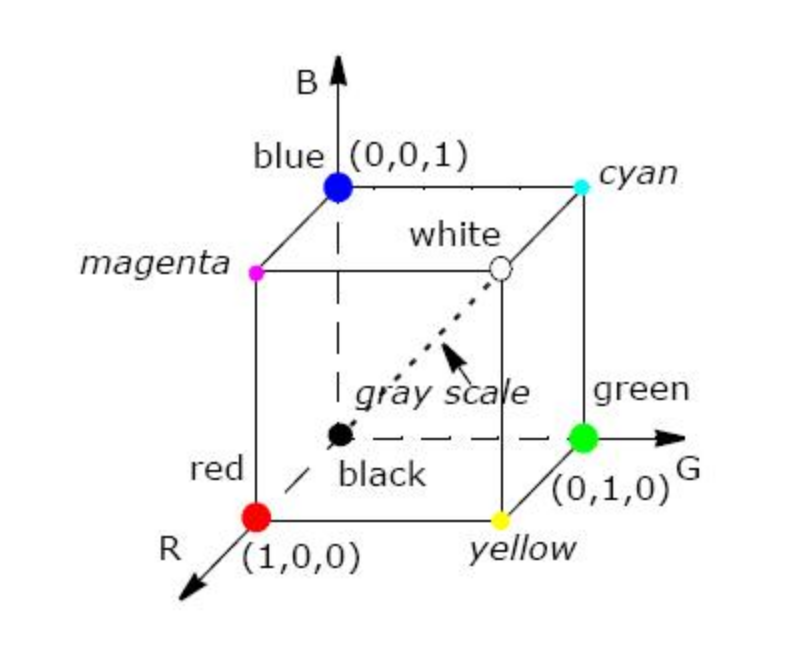

# RGB space

- Red=(255,0,0)
- Green=(0,255,0)
- Blue=(0,0,255)
- White=(255,255,255)
- Black=(0,0,0)

# YUV space

Equations for RGB to YUV space transformation

Y' range: [16, 235]

Cb and Cr range: [16, 240]

**BT.601 Standard definition for luma**

R, G and B are in [0,1] range.

$Y' = 0.299R + 0.587G + 0.114B$

Scale and get the chroma difference values

$Pb = (0.5 / (1 - 0.114)) × (B - Y')$

$Pr = (0.5 / (1 - 0.299)) × (R - Y')$

Final digital Y'CbCr or YUV values are:

$Y' = 16 + 219 × Y'$

$Cb = 128 + 224 × Pb$

$Cr = 128 + 224 × Pr$

**Benefits of YUV space**

- More efficient: The human eye is less sensitive to changes in hue than changes in brightness. As a result, an image can have less chroma information than luma information without sacrificing the perceived quality of the image.

Various YUV sampling methods:

- [YUV 4:4:4 AYUV](https://learn.microsoft.com/en-us/windows/win32/medfound/recommended-8-bit-yuv-formats-for-video-rendering#ayuv)
- [YUY2: 4:2:2 sampling](https://learn.microsoft.com/en-us/windows/win32/medfound/recommended-8-bit-yuv-formats-for-video-rendering#yuy2)
- [UYVY: 4:2:2 sampling](https://learn.microsoft.com/en-us/windows/win32/medfound/recommended-8-bit-yuv-formats-for-video-rendering#uyvy)
- [YV12: 4:2:0 planar format](https://learn.microsoft.com/en-us/windows/win32/medfound/recommended-8-bit-yuv-formats-for-video-rendering#yv12)
- [NV12: 4:2:0 planar UV interleaved](https://learn.microsoft.com/en-us/windows/win32/medfound/recommended-8-bit-yuv-formats-for-video-rendering#nv12)

# References

1. https://www.physics.ntua.gr/~konstant/HetCluster/intel12.1/ipp/ipp_manual/IPPI/ippi_ch6/ch6_color_models.htm
2. https://learn.microsoft.com/en-us/windows/win32/medfound/about-yuv-video
3. https://learn.microsoft.com/en-us/windows/win32/medfound/recommended-8-bit-yuv-formats-for-video-rendering