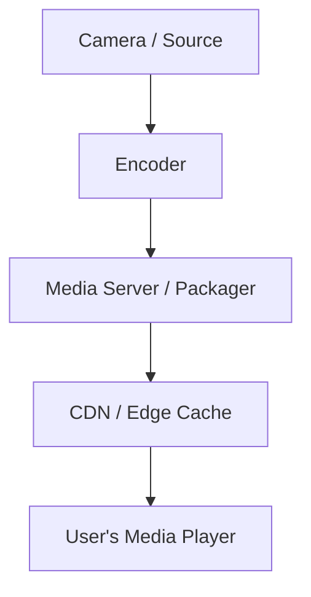

# 🌐 Introduction to Streaming

## 📌 What is Streaming?

**Streaming** is the process of delivering audio or video content over the internet in real time, without requiring the user to download the entire file beforehand. It allows content to be consumed as it is delivered, providing near-instant access to media.

Examples:

- Watching Netflix or YouTube
- Listening to music on Spotify
- Live broadcasts on Twitch or news sites

---

## 🎥 Types of Streaming

### 1. **Live Streaming**

- Content is captured and transmitted in real time
- Examples: Sports, webinars, Twitch, live news

### 2. **On-Demand Streaming**

- Pre-recorded media is stored on servers and streamed upon request
- Examples: Netflix shows, YouTube videos

---

## 🧱 Streaming Components

| Component        | Role                                             |
| ---------------- | ------------------------------------------------ |
| **Encoder**      | Converts raw video/audio into streamable formats |
| **Media Server** | Distributes content to viewers                   |
| **CDN**          | Delivers content globally with low latency       |
| **Player**       | Renders the stream on the viewer's device        |

---

## 📶 Protocols Used in Streaming

### 🔄 Adaptive Bitrate Streaming (ABR)

- Adjusts video quality based on user's bandwidth
- Segments video into small chunks

### Key Protocols:

- **HLS (HTTP Live Streaming)** – Apple standard, uses `.m3u8` playlists
- **MPEG-DASH** – Open standard, similar to HLS
- **RTMP (Real-Time Messaging Protocol)** – Low latency, used for ingest
- **WebRTC** – Ultra-low latency, used in video calls

---

## ⚙️ How Streaming Works (Simplified Flow)

- Content is encoded (e.g., H.264, AAC)
- Packaged into chunks (e.g., `.ts`, `.m4s`)
- Sent to a CDN for efficient delivery
- Played via browser or mobile player

---

## 📊 Key Metrics in Streaming

- **Startup Time**: Time to begin playback
- **Buffering Ratio**: Amount of playback interrupted by rebuffering
- **Bitrate**: Quality level of audio/video (higher = better quality)
- **Latency**: Delay between live capture and viewer playback

---

## 🔐 DRM and Security

- **DRM (Digital Rights Management)**: Prevents unauthorized use
  - Widevine (Google), FairPlay (Apple), PlayReady (Microsoft)
- **Token-based access**: Secures stream URLs
- **HTTPS**: Ensures encrypted transmission

---

## 🚀 Emerging Trends

- **Low-Latency HLS and DASH**
- **SSAI (Server-Side Ad Insertion)**
- **4K and HDR Streaming**
- **Edge Compute and AI-assisted streaming**

---

## 📚 Resources

- [Streaming Media Guide](https://www.streamingmedia.com/)
- [HLS Specification](https://datatracker.ietf.org/doc/html/draft-pantos-hls-rfc8216bis)
- [MPEG-DASH Overview](https://dashif.org/)

---

Streaming enables modern media consumption across all platforms — from mobile devices to smart TVs — transforming how content is delivered and experienced.

