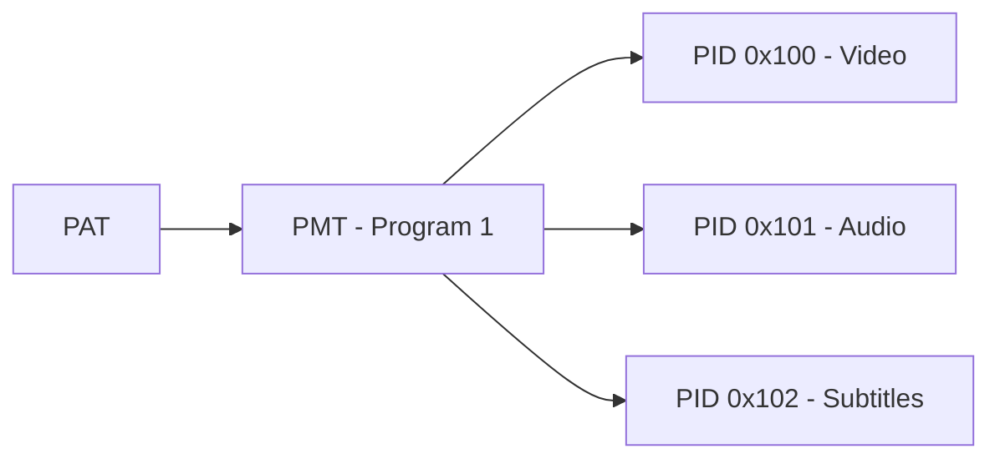
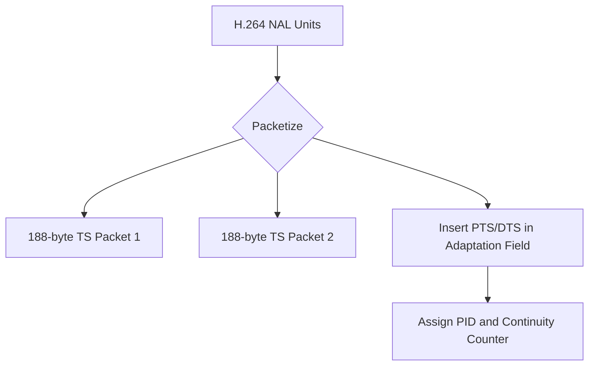

# 🧱 Video Packetization in MPEG-TS (Transport Stream)

## 🎮 What Is Video Packetization?

**Video packetization** is the process of breaking compressed audio and video data into **small, manageable packets** for storage or transmission. These packets include metadata to aid synchronization, decoding, and error recovery.

---

## 📆 Overview of MPEG-TS (MPEG-2 Transport Stream)

MPEG-TS is a **packetized container format** used in broadcasting and streaming. It is designed to be **resilient to errors** and suitable for **live delivery** over unreliable networks.

### 🔑 Key Features

- **Fixed packet size**: 188 bytes
- **Multiplexing support**: Multiple streams (audio, video, metadata)
- **Used in**: DVB, ATSC, IPTV, HLS
- **Supports**: Real-time streaming and file-based storage
- **Low overhead**: Enables efficient transport over networks
- **Fast channel switching**: Important for live TV experiences

---

## 🧰 MPEG-TS Packet Structure

Each MPEG-TS packet is exactly **188 bytes** and contains:

| Field            | Size      | Description                            |
| ---------------- | --------- | -------------------------------------- |
| Sync Byte        | 1 byte    | Always `0x47` to identify packet start |
| Header           | 3–4 bytes | PID, scrambling, continuity counter    |
| Adaptation Field | Optional  | Contains timing info like PTS, PCR     |
| Payload          | Variable  | Compressed video/audio data            |

### Key Concepts

- **PID (Packet ID)**: Uniquely identifies the stream (e.g., video = 0x100)
- **PCR (Program Clock Reference)**: Synchronizes decoders to the stream
- **PTS/DTS**: Presentation and decoding timestamps


---

## 📁 MPEG-TS in File Format

### Characteristics

- Stored on disk as a sequence of **188-byte packets**
- Extensions: `.ts`, `.m2ts`
- Often used in **Blu-ray**, **offline broadcast capture**, or **HLS segments**

### Use Cases

- Archiving broadcast streams
- Intermediate format in encoding pipelines
- Playback via media players that parse packetized streams

---

## 🌐 MPEG-TS in Streaming

### 🔗 HLS (HTTP Live Streaming)

- `.ts` segments are typically **2–10 seconds long**
- Each `.ts` file is a collection of MPEG-TS packets
- HLS playlist (`.m3u8`) defines segment order and timing

### 📡 Live/IPTV Delivery

- MPEG-TS packets sent over **UDP or RTP**
- Common in IPTV, DVB, ATSC, multicast
- **Jitter buffers** or **FEC** may be used for stability


---

## 🔄 Multiplexing & Demultiplexing

| PID   | Stream Type   |
| ----- | ------------- |
| 0x100 | Video (H.264) |
| 0x101 | Audio (AAC)   |
| 0x102 | Subtitles     |

- **Multiplexing**: Combining multiple streams into one TS
- **Demuxing**: Extracting components at playback or decode time

### Program and Transport Streams

- **PAT (Program Association Table)**: Lists available programs and their PMT PIDs
- **PMT (Program Map Table)**: Maps video, audio, and subtitle PIDs for each program



---

## 🧪 Example: Packetizing H.264 into MPEG-TS

1. **H.264 NAL units** are read from the encoder
2. NALs are split across one or more **188-byte TS packets**
3. Timing info (PTS/DTS) is inserted in **adaptation fields**
4. Packets are assigned the correct PID and continuity counter



---

## 🧰 Tools for Analysis

- **FFmpeg**: Create or inspect `.ts` files
  ```bash
  ffmpeg -i input.mp4 -c copy -f mpegts output.ts
  ```
- **tsanalyze / tsduck**: Analyze TS packet structures and PID tables
- **Wireshark**: Inspect live RTP/UDP MPEG-TS streams

---

## ✅ File vs. Streaming: Comparison

| Feature            | File-Based MPEG-TS | Streamed MPEG-TS (UDP/RTP) |
| ------------------ | ------------------ | -------------------------- |
| Medium             | Disk storage       | Network transport          |
| Use Case           | VOD, archiving     | Live TV, HLS, IPTV         |
| Packet Recovery    | Not needed         | Needed (jitter buffer/FEC) |
| Real-Time Delivery | No                 | Yes                        |
| Format             | `.ts`, `.m2ts`     | MPEG-TS over UDP/RTP       |

---

## 📚 Related Topics

- HLS Streaming Basics
- SCTE-35 Ad Signaling in MPEG-TS
- FFmpeg Transport Stream Commands

---

