# Color Space

A color space is a **contract**. It says: here are three numbers per pixel, and here is
exactly how to turn them back into light. Break any clause of that contract and the picture
is still watchable — which is precisely why color bugs survive so long in production
pipelines.

By the end of this page you should be able to answer, without guessing:

- Why does video use Y'CbCr when displays are RGB?
- What is actually thrown away by 4:2:0, and when does it show?
- Why does my file look washed out after a transcode?
- Which pixel format should I ask for, and why does the GPU keep wanting NV12?
- What makes HDR "high dynamic range" — is it the gamut, the bit depth, or something else?

---

## 1. Where three numbers come from

The retina has three types of cone, each sensitive to a broad, overlapping band of
wavelengths. A full spectrum hits them, and all your brain receives is three numbers. Two
physically different spectra that excite the cones identically are indistinguishable —
they are *metamers*. That collapse from a continuous spectrum to three numbers is the only
reason color imaging is tractable at all: a display does not have to reproduce a spectrum,
only to produce *some* spectrum that lands on the same three numbers.

So every color space is three numbers plus a set of rules. The rules come in four
independent parts, and almost every color bug you will ever chase is one of these four
being mismatched between two stages of a pipeline.

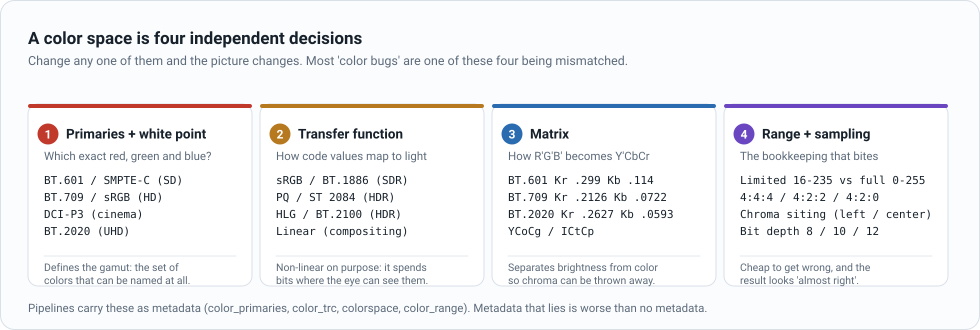

:::tip Read this as a checklist
When something looks wrong, walk the four in order: **primaries → transfer function →
matrix → range/siting**. It is nearly always one of them, and nearly always because a tool
assumed a default instead of reading the metadata.
:::

---

## 2. RGB: the space displays actually speak

A display has red, green and blue emitters. Drive them harder, get more light. Color is
built *additively*, and the set of all combinations is a cube.

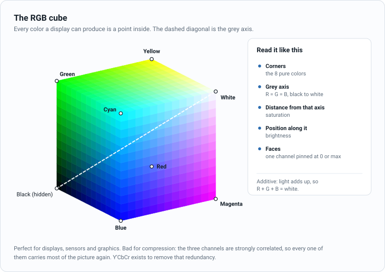

| | R | G | B |
|---|---|---|---|
| Black | 0 | 0 | 0 |
| White | 255 | 255 | 255 |
| Red | 255 | 0 | 0 |
| Green | 0 | 255 | 0 |
| Blue | 0 | 0 | 255 |
| Yellow | 255 | 255 | 0 |
| Cyan | 0 | 255 | 255 |
| Magenta | 255 | 0 | 255 |
| Any grey | v | v | v |

"RGB" on its own is not a color space — it is a *type* of color space. `(255, 0, 0)` means
nothing until you say which red. sRGB and BT.709 share the same primaries and white point
(D65), so HD video and web graphics agree on what red is; BT.2020 red is a much deeper red
at the same code value.

**RGB is the right answer when** you are compositing graphics, running a shader, feeding a
neural network, drawing overlays and tickers with alpha, or doing anything where the three
channels need to stay independent and exact.

**RGB is the wrong answer for storage and transmission**, for one reason: the three
channels are strongly correlated. In a typical frame, R, G and B each contain their own
nearly complete copy of the picture — the same edges, the same texture, the same detail.
Compress them separately and you pay for that detail three times.

---

## 3. Gamma: why the numbers are not proportional to light

Human brightness perception is roughly logarithmic. We can see a step from 1 to 2 nits
easily; a step from 501 to 502 nits is invisible. If code values were proportional to
light, we would waste most of them in the highlights, where the eye cannot tell them apart,
and starve the shadows, where it can. So code values are stored **non-linearly**.

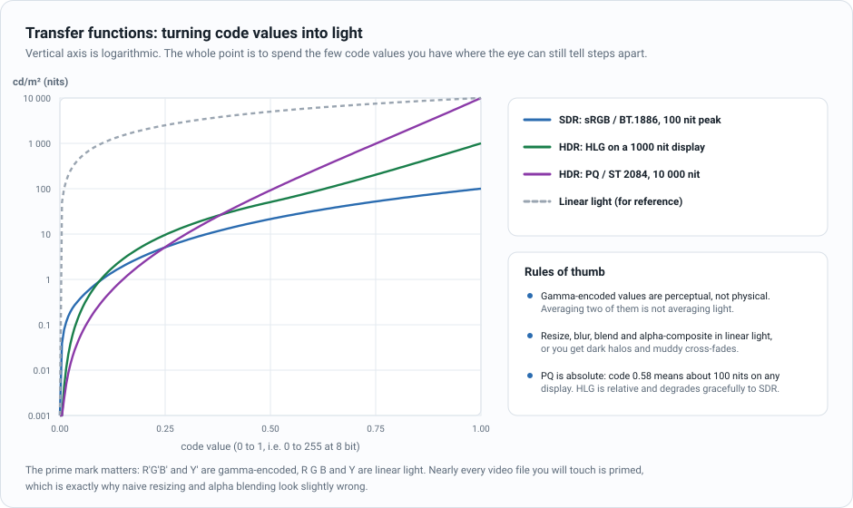

The convention is a prime mark: `R'G'B'` and `Y'` are gamma-encoded, `RGB` and `Y` are
linear light. Nearly every video file you will touch is primed. It matters more than it
looks:

- **sRGB / BT.1886 (SDR)** — roughly a 2.2 to 2.4 power law over about 100 nits.
- **PQ / SMPTE ST 2084 (HDR)** — *absolute*. Code 0.58 means about 100 cd/m² on any
  display that claims PQ, up to a 10 000 cd/m² ceiling. Great for mastering, unforgiving
  if the display cannot reach the levels in the signal.
- **HLG / ARIB STD-B67 (HDR)** — *relative*, and the lower half of the curve is a plain
  square root, so an SDR display showing an HLG signal produces something reasonable.
  Designed for live broadcast, where you cannot ask every viewer to upgrade.

:::warning The rule people break most often
Resizing, blurring, alpha compositing and cross-fading are all **weighted averages of
light**. Doing them on gamma-encoded values averages the wrong quantity: fades go muddy in
the middle, downscaled bright detail turns grey, and antialiased edges pick up dark halos.
Convert to linear light, do the arithmetic, convert back. In `ffmpeg` the relevant
incantation is `zscale=t=linear` before the filter and `zscale=t=bt709` after it.
:::

---

## 4. Y'CbCr: separating brightness from color

Split the picture into one brightness channel and two color-difference channels. The
brightness channel carries almost all the structure; the color-difference channels are
smooth and low-detail. Now you can spend your bits asymmetrically.

The luma coefficients are not arbitrary — they are a weighted sum of R', G' and B' with
green dominant, because the eye is far more sensitive to green.

$$
Y' = K_R R' + (1 - K_R - K_B) G' + K_B B'
$$

$$
P_B = \frac{B' - Y'}{2 (1 - K_B)} \qquad P_R = \frac{R' - Y'}{2 (1 - K_R)}
$$

With `R'G'B'` in the range 0 to 1, `Y'` comes out 0 to 1 and `Pb`, `Pr` come out -0.5 to
+0.5. The scaling by `2(1-K)` exists purely so both chroma channels use the full available
swing.

| Standard | Used for | $K_R$ | $K_G$ | $K_B$ |
|---|---|---|---|---|
| **BT.601** | SD, DVD, legacy | 0.299 | 0.587 | 0.114 |
| **BT.709** | HD, most of the web | 0.2126 | 0.7152 | 0.0722 |
| **BT.2020** | UHD, HDR | 0.2627 | 0.6780 | 0.0593 |

Then quantise to integers. For 8-bit **limited range**:

$$
Y'_{digital} = 16 + 219 \, Y' \qquad C_B = 128 + 224 \, P_B \qquad C_R = 128 + 224 \, P_R
$$

For 10-bit, multiply all of those by 4 (`Y'` becomes 64 + 876·Y', neutral chroma becomes
512).

### Worked example: pure red in BT.709

$Y' = 0.2126 \times 1 + 0.7152 \times 0 + 0.0722 \times 0 = 0.2126$

$P_B = (0 - 0.2126) / (2 \times 0.9278) = -0.1146$

$P_R = (1 - 0.2126) / (2 \times 0.7874) = 0.5000$

$Y'_{digital} = 16 + 219 \times 0.2126 = 63$, $C_B = 128 + 224 \times -0.1146 = 102$,
$C_R = 128 + 224 \times 0.5 = 240$

Note that `Cr` hits exactly 240, the top of the chroma range. That is the scaling doing its
job: a pure primary lands exactly on the boundary.

### Reference values, 8-bit limited range

| Color | RGB | BT.601 Y'CbCr | BT.709 Y'CbCr |
|---|---|---|---|
| Black | 0, 0, 0 | 16, 128, 128 | 16, 128, 128 |
| White | 255, 255, 255 | 235, 128, 128 | 235, 128, 128 |
| Mid grey | 128, 128, 128 | 126, 128, 128 | 126, 128, 128 |
| Red | 255, 0, 0 | 81, 90, 240 | 63, 102, 240 |
| Green | 0, 255, 0 | 145, 54, 34 | 173, 42, 26 |
| Blue | 0, 0, 255 | 41, 240, 110 | 32, 240, 118 |
| Yellow | 255, 255, 0 | 210, 16, 146 | 219, 16, 138 |
| Cyan | 0, 255, 255 | 170, 166, 16 | 188, 154, 16 |
| Magenta | 255, 0, 255 | 106, 202, 222 | 78, 214, 230 |
| Skin tone | 224, 172, 140 | 174, 106, 153 | 171, 109, 152 |
| Grass | 58, 110, 45 | 91, 107, 110 | 97, 105, 108 |

Two things worth noticing. **Neutral colors are identical in both standards** — greys have
no chroma, so the matrix cannot get them wrong. And **ordinary content barely moves**: the
skin tone shifts by 3 code values between BT.601 and BT.709. That is why a wrong-matrix bug
passes casual inspection and then shows up as a stubborn green cast in grass or a dull look
in saturated jerseys, exactly where the difference peaks.

### The chroma plane

Take a frame and throw the brightness away. For every pixel, keep only `(Cb, Cr)` and plot
it. What you get is a two-dimensional map of *colour without brightness*.

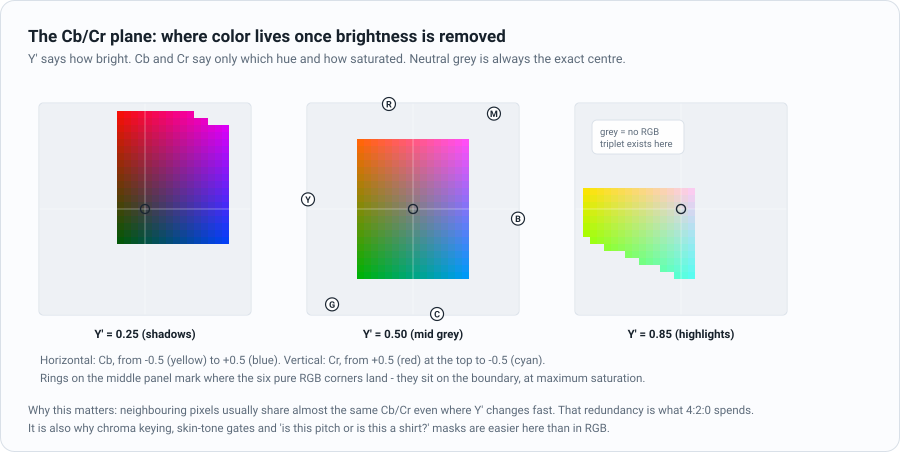

Three things to read off it:

- **The centre is the absence of colour.** Black, mid grey and white all land on exactly the
  same point, `(128, 128)`. They differ only in Y', which is an axis running perpendicular
  to this page.
- **Radius is saturation.** A pastel pink sits near the middle; a fire-engine red sits near
  the boundary.
- **Angle is hue.** Every shade of green points in one direction, every shade of orange in
  another, all the way round.

Now the property that makes the whole page worth reading. Suppose you brighten a scene by
turning up the lights, so every linear RGB value is multiplied by some factor. After gamma
encoding, all three of `R'`, `G'` and `B'` scale by the same factor `k`. Look at what that
does to the maths:

$$
Y' \to k Y' \qquad C_B \to k C_B \qquad C_R \to k C_R
$$

Both colour differences scale by exactly the same `k` as the luma. Which means, on the
plane, **the pixel slides along a straight line through the centre and its angle does not
change.** Exposure moves you radially. Hue is what survives.

That is not quite exact in practice — sRGB has a small linear toe near black, ambient light
is usually bluer than key light, and real cameras are not pure power laws — but it is close
enough to be the foundation of an entire industry.

### Worked example: why chroma keying lives on this plane

The task: decide, for every pixel, whether it is the green screen or the subject in front of
it. The obvious approach is a distance test in RGB — "how far is this pixel from green?" —
and it fails badly, for a reason the numbers make brutally clear.

Here is one standard chroma-key green, `#00B140`, photographed at three points on a real
screen: the well-lit middle, a corner in shadow, and a hot spot where a lamp is too close.
It is the *same paint*, three stops apart.

| The same screen | RGB | Y'CbCr (BT.709) | Hue angle | Radius |
|---|---|---|---|---|
| Hot spot | 0, 251, 94 | 176, 84, 24 | 247.1° | 113 |
| Key light | 0, 177, 64 | 129, 96, 55 | 246.3° | 80 |
| Deep shadow | 0, 102, 33 | 81, 108, 86 | 244.5° | 47 |

The hue angle moves by **1.8 degrees** across the whole range. The radius nearly triples,
exactly as the scaling argument predicts, and the RGB values are unrecognisable as the same
colour.

Now put a foreground next to it and ask how much room a keyer has to work with:

| Distance from the key colour | Screen's own spread | Nearest foreground (a green jumper) | Margin |
|---|---|---|---|
| RGB Euclidean | 81.2 | 82.9 | **1.0×** |
| Cb/Cr Euclidean | 33.2 | 50.4 | 1.5× |
| Hue angle | 1.8° | 16.1° | **8.9×** |

Read the first row again. **In RGB, the screen's own lighting variation is as large as the
distance to a completely different object.** Any tolerance wide enough to catch the shadowed
corner also catches the jumper. There is no threshold that works. The same measurement in
the chroma plane gives you a 1.5× margin, and measured as an angle it gives you 8.9×.

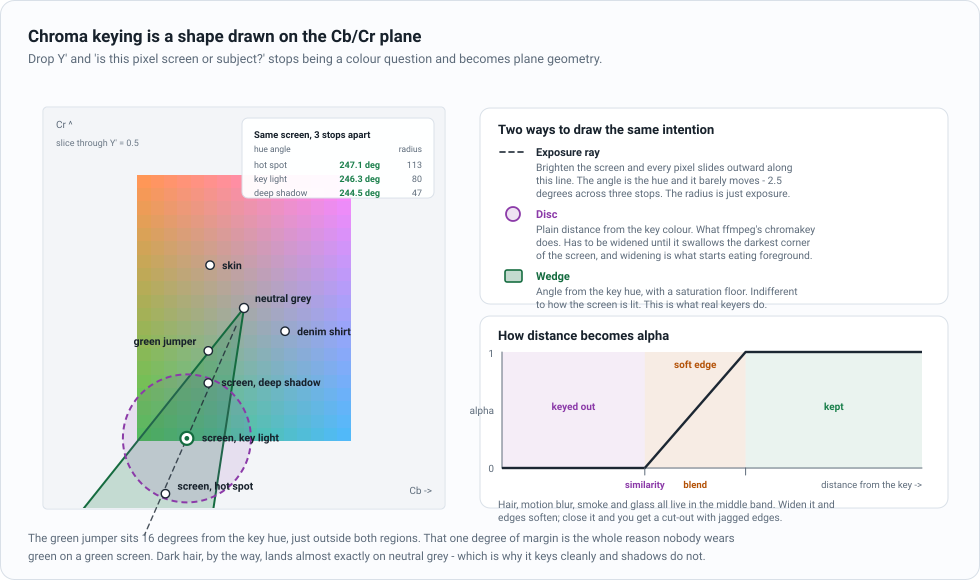

So a keyer is nothing more exotic than **a region drawn on this plane**, plus a rule for
turning distance-from-that-region into alpha:

1. **Pick the key point.** Sample the screen, take its `(Cb, Cr)`.
2. **Choose an acceptance region.** A disc around the key point is the naive version; a
   wedge around the key *hue*, with a minimum saturation, is what survives an unevenly lit
   screen.
3. **Choose a softness.** Inside the region, alpha is 0. Outside a second, larger boundary,
   alpha is 1. In between, alpha ramps — and that band is where hair, motion blur, smoke and
   the edges of glass live. Get it too narrow and you get a jagged cut-out; too wide and the
   subject goes transparent.

`ffmpeg` ships both versions of step 2, which makes the difference easy to see:

```bash
# Disc in the Cb/Cr plane. Ignores Y' entirely.
ffmpeg -i shot.mov -vf "chromakey=0x00B140:0.15:0.10,format=yuva420p" keyed.mov

# Sphere in RGB. Same syntax, very different geometry.
ffmpeg -i shot.mov -vf "colorkey=0x00B140:0.15:0.10,format=rgba" keyed_rgb.mov
```

`chromakey` computes plain Euclidean distance in the chroma plane and compares it against
`similarity × 255 × √2`; Y' never enters the calculation. That is worth knowing because it
explains the filter's main weakness: a shadowed patch of screen has a *smaller* chroma
radius, so it drifts away from the key point, and you have to keep widening `similarity`
until the disc reaches it. On a screen graded down to a quarter of its key-light exposure,
the required radius works out at about 0.11 in the filter's units — and measuring it on a
synthetic gradient, the screen clears at 0.14. The wedge in the diagram above would not have
had to move at all.

:::tip Everything else in keying is the same geometry
**Spill** is green light bouncing off the screen onto the subject. On the plane it drags
foreground pixels along a line *towards* the key hue. Spill suppression pushes them back
along that same line — it is the identical vector, negated.

**Why nobody wears green.** The jumper in the table sits 16 degrees from the key hue. That
sounds like a lot until you notice the screen itself spans 2.5 of those degrees before a
single lighting mistake.

**Why 4:2:0 ruins a key.** Your matte is computed entirely from Cb and Cr. At 4:2:0 those
are quarter-resolution, so the alpha channel you pull has quarter-resolution edges no matter
how sharp the luma is. Shoot and deliver keying material at 4:2:2 at the very least, 4:4:4
if you can — this is the single most common reason a key looks soft and blocky around hair.
:::

The same geometry drives every "find the thing by its colour" problem, which is most of
them: skin-tone gates, pitch and court detection, jersey and team assignment, ball tracking
against grass. In each case the nuisance variable is illumination, and Y'CbCr has already
put it on an axis you can ignore.

:::info Why not HSV?
HSV has a hue angle too, and for a lot of quick masking work it is fine. Two things make
Cb/Cr the better tool in a video pipeline. First, it is already there — the decoder handed
it to you, while HSV costs a per-pixel conversion with branches in it. Second, HSV's hue is
computed from the max and min of R, G and B, which makes it numerically unstable as
saturation approaches zero and gives it a discontinuity at 0°/360°. On the chroma plane you
work with the vector `(Cb − 128, Cr − 128)` and never have to take an angle at all, so
neither problem arises.
:::

### A note on names

| Name | What it really means |
|---|---|
| **YUV** | Strictly, the analogue PAL/NTSC encoding. Used colloquially — and in `ffmpeg` — for anything luma-plus-chroma. |
| **Y'PbPr** | Analogue component, continuous, chroma in -0.5 to +0.5. |
| **Y'CbCr** | The digital, scaled, quantised version. This is what is in your files. |
| **YCbCr without the prime** | Almost always a typo for Y'CbCr. True linear-light luma is rare outside color science. |

Everyone says "YUV". Everyone means Y'CbCr. Be precise in specs, relaxed in conversation.

---

## 5. Limited range vs full range

8-bit video does not use 0 to 255. It uses **16 to 235** for luma and **16 to 240** for
chroma, leaving footroom and headroom for filter overshoot and legacy analogue levels.

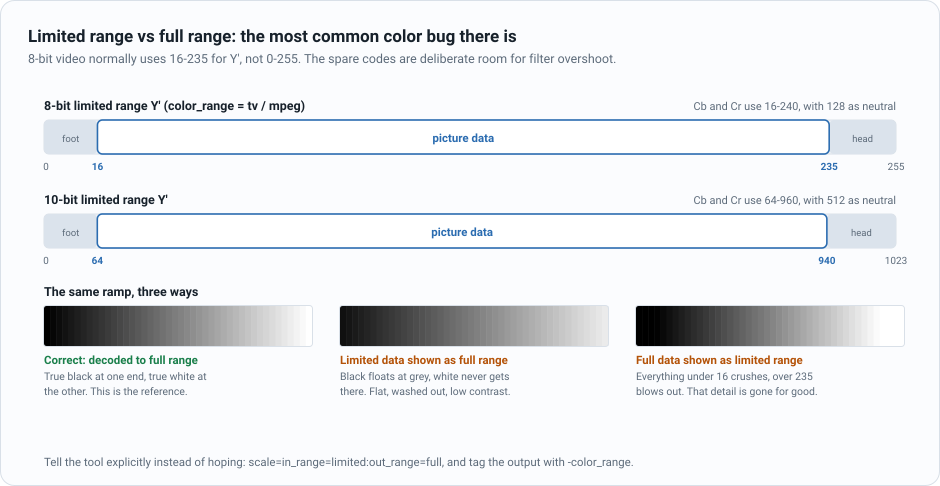

| | 8-bit | 10-bit | `ffmpeg` tag |
|---|---|---|---|
| Limited / "TV" / MPEG | Y 16–235, C 16–240 | Y 64–940, C 64–960 | `-color_range tv` |
| Full / "PC" / JPEG | Y 0–255, C 0–255 | Y 0–1023, C 0–1023 | `-color_range pc` |

Getting this wrong is the single most common color bug in the industry, and it is
symmetrical: treat limited data as full and everything looks flat and washed out; treat
full data as limited and shadows crush to black while highlights clip. The second one is
destructive — the clipped detail does not come back.

The fix is never to hope. Convert explicitly with
`scale=in_range=limited:out_range=full` and tag the output with `-color_range`.

---

## 6. Chroma subsampling

Because chroma is smooth and the eye is bad at it, you can sample it less often than luma.
The notation is `J:a:b`, describing a reference block `J` pixels wide and 2 tall: `a` is the
number of chroma samples in the top row, `b` the number in the bottom row.

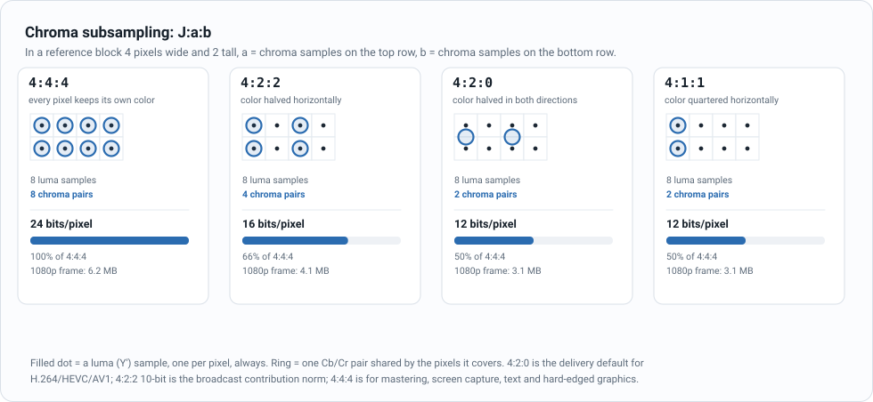

| Scheme | Chroma resolution | Bits/pixel | Bandwidth | Typically found in |
|---|---|---|---|---|
| **4:4:4** | full | 24 | 100% | Mastering, screen capture, graphics, keying |
| **4:2:2** | half horizontal | 16 | 67% | Broadcast contribution, ProRes 422, SDI, editing |
| **4:2:0** | half both ways | 12 | 50% | Everything delivered: H.264, HEVC, AV1, Blu-ray, streaming |
| **4:1:1** | quarter horizontal | 12 | 50% | DV, DVCPRO — historical |

At 1080p50 that is 2.49 Gbit/s uncompressed at 4:4:4, 1.66 at 4:2:2 and 1.24 at 4:2:0 —
before a codec has done anything at all. Subsampling is free compression, which is why it
happens first.

**Where 4:2:0 visibly hurts:** thin saturated graphics on a contrasting background — a red
scoreline over green grass, colored subtitles, a station logo — and any text that is not
grey. Chroma edges land at half resolution, so they ring and smear. It also hurts anything
you plan to *key* or *re-grade*, because you are pulling a matte from a half-resolution
signal. Shoot and contribute in 4:2:2 or 4:4:4, deliver in 4:2:0.

### Chroma siting

Fewer chroma samples raises a question the notation does not answer: *where* is the
surviving sample?

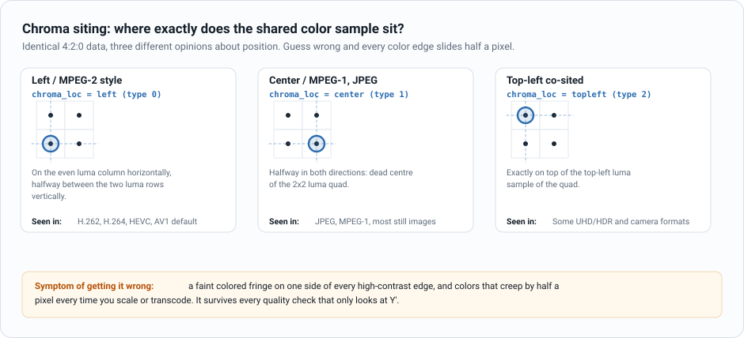

H.264, HEVC and AV1 default to **left** siting; JPEG and MPEG-1 use **center**. Convert
between them without adjusting and every color edge shifts half a pixel — a faint fringe on
one side of each high-contrast edge, cumulative across transcodes, and invisible to any
quality metric that only looks at luma. `ffmpeg`'s `zscale` filter takes `cin` and `c` to
set input and output chroma location.

---

## 7. Pixel formats: how the bytes actually sit

Sampling ratio says how much color you keep. **Pixel format** says how those samples are
arranged in memory — and that is a separate decision that hardware cares about intensely.

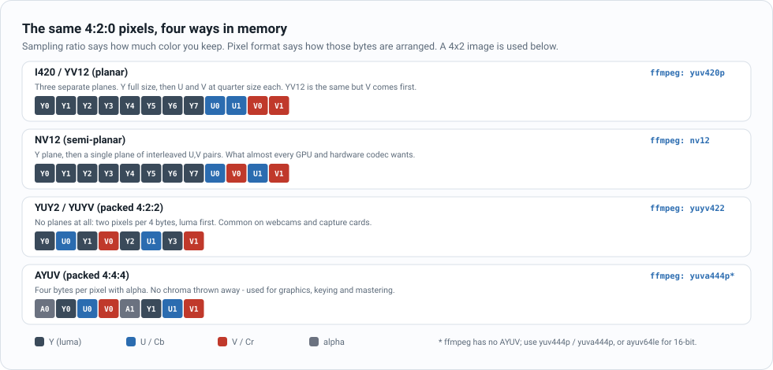

| Format | Sampling | Layout | `ffmpeg` name | Why it exists |
|---|---|---|---|---|
| **I420** | 4:2:0 | Planar Y, U, V | `yuv420p` | The software default. Easiest to process plane by plane. |
| **YV12** | 4:2:0 | Planar Y, V, U | `yuv420p` with planes swapped | Same as I420 with V first. A classic source of red/blue swaps. |
| **NV12** | 4:2:0 | Planar Y + interleaved UV | `nv12` | What GPUs, hardware encoders and capture SDKs want. One chroma fetch instead of two. |
| **P010** | 4:2:0 10-bit | NV12 layout, 16-bit words | `p010le` | The 10-bit HDR workhorse. |
| **YUY2 / YUYV** | 4:2:2 | Packed, 2 pixels per 4 bytes | `yuyv422` | Webcams, capture cards, older APIs. |
| **UYVY** | 4:2:2 | Packed, chroma first | `uyvy422` | SDI and broadcast hardware. |
| **I422 / I444** | 4:2:2 / 4:4:4 | Planar | `yuv422p`, `yuv444p` | Intermediate and mastering formats. |
| **AYUV** | 4:4:4 + alpha | Packed 4 bytes/pixel | `yuva444p` (nearest) | Graphics and keying with transparency. |

If you are writing anything that touches a hardware codec or a GPU texture, assume **NV12**
(8-bit) or **P010** (10-bit) and you will be right most of the time. If you are writing
image-processing code, ask for planar — `yuv420p` — because you can operate on the luma
plane alone without a stride dance.

`ffmpeg -pix_fmts` lists everything the build supports, with bit depth and component count.

---

## 8. Wide gamut and HDR

### Gamut is about the primaries

Change which red, green and blue you use and you change the set of colors that can be
represented at all.

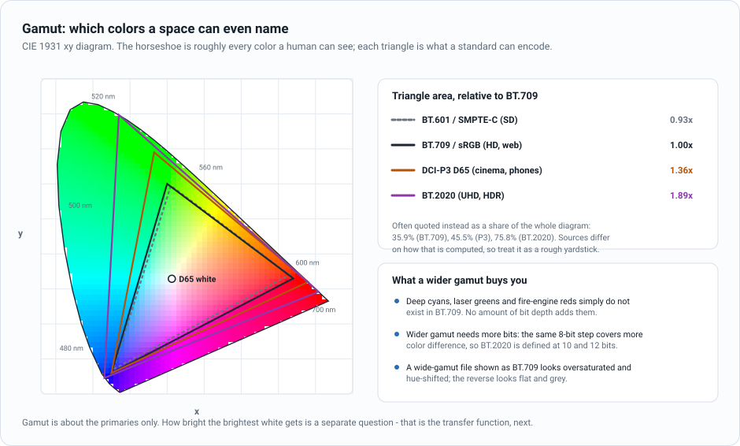

| Space | Primaries chosen for | White | Where you meet it |
|---|---|---|---|
| **BT.601 / SMPTE-C** | 1950s phosphors | D65 | SD archive material |
| **BT.709 / sRGB** | CRT-era HD | D65 | HD broadcast, the entire web |
| **DCI-P3 / Display P3** | Digital cinema projectors | DCI or D65 | Cinema, iPhones, most modern laptops |
| **BT.2020** | The future, deliberately | D65 | UHD and HDR delivery |

BT.2020 primaries are on the spectral locus — they are monochromatic wavelengths, not
realisable by any physical display today. It was defined as a container with room to grow.
In practice, UHD content is graded on a P3 monitor and delivered inside a BT.2020 container.

### HDR is a transfer function, not a gamut

This trips people up constantly. "HDR" content is characterised by:

1. **A transfer function** that covers a much wider luminance range — PQ or HLG instead of
   BT.1886. This is the part that makes it *high dynamic range*.
2. **Wide gamut**, usually BT.2020 primaries. This is a separate axis: you can have wide
   gamut SDR, and in principle narrow-gamut HDR.
3. **10-bit or more.** With 8 bits, a PQ curve spanning 0.005 to 1000 nits bands visibly.
   Bit depth is not what makes it HDR; it is what makes HDR watchable.
4. **Metadata.** Static (SMPTE ST 2086 mastering display, MaxCLL/MaxFALL) or dynamic
   (Dolby Vision, HDR10+), telling the display how the content was graded so it can tone-map
   sensibly.

Strip the metadata and an HDR file becomes an unwatchably dark SDR file. This is the HDR
equivalent of the limited/full range bug, and it is just as common.

:::info Constant luminance and ICtCp
Ordinary Y'CbCr computes luma from *gamma-encoded* R'G'B'. That is mathematically sloppy:
some of the true luminance leaks into the chroma channels, and subsampling then discards a
bit of it. BT.2020 defines a constant-luminance variant that fixes this, and BT.2100 defines
**ICtCp**, which derives its channels from linear light through a perceptual curve. ICtCp
is far better behaved under subsampling and chroma compression at HDR luminance levels. It
is rarely used end-to-end, but it is the right space for measuring HDR color error.
:::

---

## 9. Other spaces you will meet

| Space | Shape | Good at | Bad at |
|---|---|---|---|
| **HSV / HSL** | Cylinder: hue angle, saturation, value | Intuitive UI color pickers; crude "is this green?" masks | Perceptually non-uniform; V is not brightness; hue wraps at 0/360 |
| **CIE XYZ** | Device-independent tristimulus | The hub every other space converts through | Not perceptually uniform; not for storage |
| **CIE Lab / LCh** | Perceptually uniform-ish | Measuring color *difference* (ΔE), gamut mapping, print | Expensive; needs a white point; no native video plumbing |
| **OKLab / OKLCh** | Modern perceptual | Gradients and interpolation that do not go grey in the middle | Newer; little video tooling |
| **YCoCg** | Lifting-based luma/chroma | Lossless and near-lossless coding; cheap integer transform | Not a broadcast standard |
| **CMYK** | Subtractive | Print | Irrelevant to video, will appear in your PDFs |
| **Log (S-Log3, V-Log, C-Log)** | Camera-native curve | Preserving highlight latitude in the camera for grading | Looks flat and wrong until graded; each vendor differs |
| **ACES (AP0/AP1)** | Huge, scene-linear | Film and VFX interchange; a single grading reference | Overkill for broadcast delivery |

---

## 10. Which space when

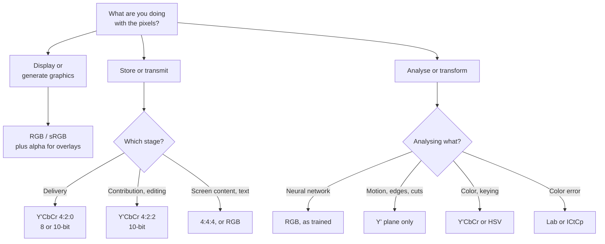

### By task

| Task | Use | Why |
|---|---|---|
| Encoding for delivery | Y'CbCr 4:2:0, BT.709 or BT.2020 | What every codec is tuned for; half the data before compression |
| Broadcast contribution, mezzanine | Y'CbCr 4:2:2 10-bit | Survives repeated re-encoding and grading; enough chroma to key from |
| Screen recording, slides, terminal capture | RGB or 4:4:4 | Text is thin, saturated and high-contrast — the worst case for 4:2:0 |
| Overlays, tickers, scoreboards, lower-thirds | RGB with alpha | Alpha needs full-resolution, uncorrelated channels |
| Scaling, blurring, cross-fades | Linear-light RGB | These are averages of light, not of code values |
| Chroma keying | 4:4:4 or 4:2:2 Y'CbCr | Matte quality is chroma-resolution-limited |
| Skin, grass, jersey detection | Y'CbCr or HSV | Illumination changes move Y' and leave the chroma roughly alone |
| Motion vectors, optical flow, scene cuts, OCR pre-pass | Y' plane | The luma plane is already decoded and separate — you get it for free |
| CNN / transformer inference | RGB, matching training | Almost every published model is trained on sRGB; a Y'CbCr tensor is a silent accuracy bug |
| Thumbnails, posters, previews | sRGB | Where the picture is going anyway |
| Measuring color error | Lab (ΔE) or ICtCp | Euclidean distance in Y'CbCr is not perceptual distance |
| Grading and VFX | Log or linear, wide gamut | Preserves latitude and lets math behave |

:::tip For video-analysis and ML pipelines specifically
Decoding gives you Y'CbCr, usually `yuv420p`. Models want RGB. That conversion is not free
at scale, so:

- If your model only needs structure — shot boundaries, motion, tracking, text detection —
  work on the **Y' plane directly** and skip the conversion entirely.
- If you do need RGB, convert **once**, on the GPU, in the decode path, and make sure the
  matrix and range are right. A BT.601 conversion applied to BT.709 content is a small,
  consistent, systematic shift in your input distribution — precisely the kind of thing that
  quietly costs a couple of points of accuracy and never shows up as a crash.
- Colorspace metadata is per-stream, not per-project. Never hardcode it.
:::

---

## 11. The chain, end to end

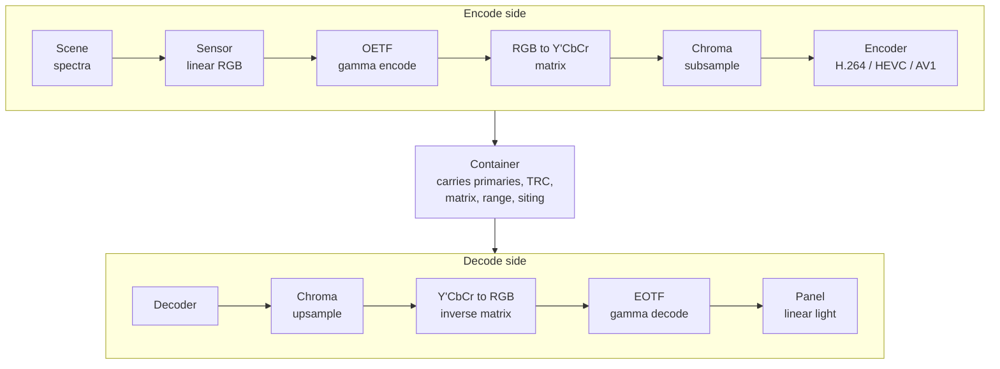

Every arrow in the decode half needs to be told what the encode half did. That is the entire
job of `color_primaries`, `color_trc`, `colorspace`, `color_range` and `chroma_location`.
Carry them faithfully and the chain is lossless in intent; drop them and every downstream
tool falls back to a guess, usually BT.709 limited range, which is right often enough to
hide the times it is wrong.

---

## 12. Symptoms and causes

| What you see | Almost certainly | Check |
|---|---|---|
| Flat, milky, blacks are grey | Limited-range data shown as full range | `color_range`, `scale=in_range` |
| Crushed shadows, blown highlights | Full-range data shown as limited | Same, other direction. Detail is already lost |
| Slight green or magenta cast, worst in grass and jerseys | BT.601 matrix applied to BT.709 content or vice versa | `colorspace` tag; `-vf scale=in_color_matrix=...` |
| Red and blue swapped | I420 vs YV12 plane order, or BGR vs RGB | Plane order in your buffer code |
| Colored fringe on one side of edges, drifting across transcodes | Chroma siting mismatch | `chroma_location`; `zscale=cin=...:c=...` |
| Colored text looks smeared, thin graphics ring | 4:2:0 on screen content | Encode 4:4:4, or keep graphics as a separate RGB layer |
| Dark halos after downscaling; cross-fades go muddy | Filtering gamma-encoded values | Wrap the filter in `zscale=t=linear` / `zscale=t=bt709` |
| Whole file is very dark on an SDR screen | HDR (PQ) content with no tone-map | Tone-map explicitly, or deliver an SDR version |
| Banding in skies and gradients | 8-bit for the gamut or curve in use | Go 10-bit; add dither on the way down |
| Colors oversaturated and hue-shifted | BT.2020 content interpreted as BT.709 | `color_primaries` |

---

## 13. Try it yourself

### Inspect what you actually have

```bash
ffprobe -v error -select_streams v:0 \
  -show_entries stream=pix_fmt,color_range,color_space,color_transfer,color_primaries,chroma_location \
  -of default=noprint_wrappers=1 input.mp4
```

An empty value means *unspecified*, not *default*. Downstream tools will guess.

### See the planes separately

```bash
# Y', Cb and Cr as three greyscale videos
ffmpeg -i input.mp4 -filter_complex \
  "format=yuv420p,extractplanes=y+u+v[y][u][v]" \
  -map "[y]" y.mp4 -map "[u]" u.mp4 -map "[v]" v.mp4

# Luma only: watch how much of the picture survives
ffmpeg -i input.mp4 -vf "lutyuv=u=128:v=128" luma_only.mp4

# Chroma only: watch how little detail is in there
ffmpeg -i input.mp4 -vf "lutyuv=y=128" chroma_only.mp4
```

### Watch 4:2:0 destroy fine color detail

```bash
# Round-trip a sharp RGB source through 4:2:0 and back
ffmpeg -i graphic.png -vf "format=yuv420p,format=rgb24" via_420.png

# Same through 4:4:4 for comparison
ffmpeg -i graphic.png -vf "format=yuv444p,format=rgb24" via_444.png
```

Use something with saturated thin lines — a test card, colored text, `testsrc2`. On a
photograph you will struggle to see the difference, which is exactly the point.

### Convert correctly

```bash
# Limited to full range, explicitly
ffmpeg -i in.mp4 -vf "scale=in_range=limited:out_range=full" \
  -color_range pc out.mp4

# BT.601 SD source to BT.709 HD, matrix and tags together
ffmpeg -i sd.mp4 \
  -vf "scale=1920:1080:in_color_matrix=bt601:out_color_matrix=bt709" \
  -colorspace bt709 -color_primaries bt709 -color_trc bt709 hd.mp4

# Scale in linear light, the right way.
# zscale refuses to work on an untagged stream, so state what the input is
# with setparams first - this is the step everyone forgets.
ffmpeg -i in.mp4 -vf \
  "setparams=color_primaries=bt709:color_trc=bt709:colorspace=bt709:range=tv,\
zscale=t=linear:npl=100,scale=1280:720,zscale=t=bt709" out.mp4

# HDR (PQ, BT.2020) down to SDR BT.709. Needs a correctly tagged source.
ffmpeg -i hdr.mp4 -vf \
  "zscale=t=linear:npl=100,format=gbrpf32le,zscale=p=bt709,tonemap=hable,zscale=t=bt709:m=bt709:r=tv,format=yuv420p" \
  sdr.mp4

# Generate a colour bar test pattern to experiment on
ffmpeg -f lavfi -i smptehdbars=size=1920x1080:duration=10 -pix_fmt yuv422p10le bars.mov
```

### The matrix in twelve lines of Python

```python
import numpy as np

# BT.709 luma coefficients
KR, KB = 0.2126, 0.0722
KG = 1 - KR - KB

def rgb_to_ycbcr(rgb8, full_range=False):
    """rgb8: uint8 array (H, W, 3), already gamma-encoded (R'G'B')."""
    r, g, b = (rgb8.astype(np.float64) / 255.0).transpose(2, 0, 1)
    y  = KR * r + KG * g + KB * b          # 0..1
    cb = (b - y) / (2 * (1 - KB))          # -0.5..+0.5
    cr = (r - y) / (2 * (1 - KR))
    if full_range:
        out = np.stack([y * 255, cb * 255 + 128, cr * 255 + 128], -1)
    else:
        out = np.stack([16 + 219 * y, 128 + 224 * cb, 128 + 224 * cr], -1)
    return np.clip(np.round(out), 0, 255).astype(np.uint8)

print(rgb_to_ycbcr(np.array([[[255, 0, 0]]], dtype=np.uint8)))   # -> [[[ 63 102 240]]]
```

And the subsampling round trip, to see what 4:2:0 actually costs:

```python
def subsample_420(ycbcr):
    """Box-average chroma 2x2, then replicate it back. Luma untouched."""
    y  = ycbcr[..., 0]
    cb = ycbcr[..., 1].astype(np.float64)
    cr = ycbcr[..., 2].astype(np.float64)
    h, w = cb.shape
    h, w = h - h % 2, w - w % 2
    small = lambda c: c[:h, :w].reshape(h // 2, 2, w // 2, 2).mean((1, 3))
    up    = lambda c: np.repeat(np.repeat(c, 2, 0), 2, 1)
    return np.stack([y[:h, :w], up(small(cb)), up(small(cr))], -1).astype(np.uint8)
```

Feed it a frame with red text on a green background and diff the result against the
original. Then feed it a photograph of a face and diff that. The gap between those two
results is the entire argument for 4:2:0.

---

## 14. Cheat sheet

| Question | Short answer |
|---|---|
| Default for delivery | Y'CbCr 4:2:0 8-bit, BT.709, limited range |
| Default for UHD/HDR delivery | Y'CbCr 4:2:0 10-bit, BT.2020, PQ or HLG, limited range |
| Default for editing and contribution | Y'CbCr 4:2:2 10-bit |
| Default for graphics and analysis | RGB, full range |
| Default for GPU and hardware codecs | NV12, or P010 at 10-bit |
| SD source | BT.601 matrix, SMPTE-C primaries |
| HD source | BT.709 |
| Any file with no color metadata | Assume BT.709 limited range, and say so loudly |
| Averaging pixels | Do it in linear light |
| Comparing colors | Do it in Lab or ICtCp, never in Y'CbCr |

---

## References

**Standards**

1. ITU-R BT.601 — [Studio encoding parameters of digital television for standard 4:3 and wide-screen 16:9 aspect ratios](https://www.itu.int/rec/R-REC-BT.601)
2. ITU-R BT.709 — [Parameter values for the HDTV standards for production and international programme exchange](https://www.itu.int/rec/R-REC-BT.709)
3. ITU-R BT.2020 — [Parameter values for ultra-high definition television systems](https://www.itu.int/rec/R-REC-BT.2020)
4. ITU-R BT.2100 — [Image parameter values for high dynamic range television](https://www.itu.int/rec/R-REC-BT.2100) (PQ, HLG and ICtCp)
5. ITU-R BT.1886 — [Reference electro-optical transfer function for flat panel displays](https://www.itu.int/rec/R-REC-BT.1886)
6. SMPTE ST 2084 — Perceptual quantizer EOTF
7. IEC 61966-2-1 — sRGB

**Practical**

8. Microsoft — [About YUV video](https://learn.microsoft.com/en-us/windows/win32/medfound/about-yuv-video)
9. Microsoft — [Recommended 8-bit YUV formats for video rendering](https://learn.microsoft.com/en-us/windows/win32/medfound/recommended-8-bit-yuv-formats-for-video-rendering)
10. Intel IPP — [Color models](https://www.physics.ntua.gr/~konstant/HetCluster/intel12.1/ipp/ipp_manual/IPPI/ippi_ch6/ch6_color_models.htm)
11. FFmpeg — [`scale`](https://ffmpeg.org/ffmpeg-filters.html#scale) and [`zscale`](https://ffmpeg.org/ffmpeg-filters.html#zscale) filter documentation
12. Linux kernel — [V4L2 YUV formats](https://docs.kernel.org/userspace-api/media/v4l/yuv-formats.html)

**Background reading**

13. Charles Poynton, *Digital Video and HD: Algorithms and Interfaces* — the standard reference, and the source of most of the "everyone gets this wrong" folklore that turns out to be true
14. Keith Jack, *Video Demystified* — format-by-format detail
15. Poynton, [Gamma FAQ](https://poynton.ca/GammaFAQ.html) and [Color FAQ](https://poynton.ca/ColorFAQ.html) — short, free, and worth reading twice
