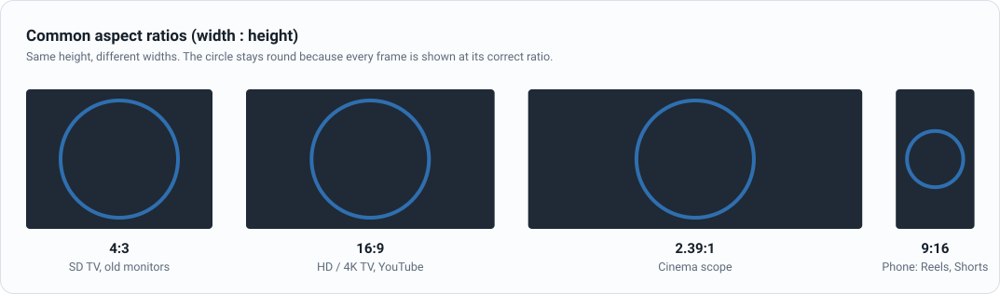
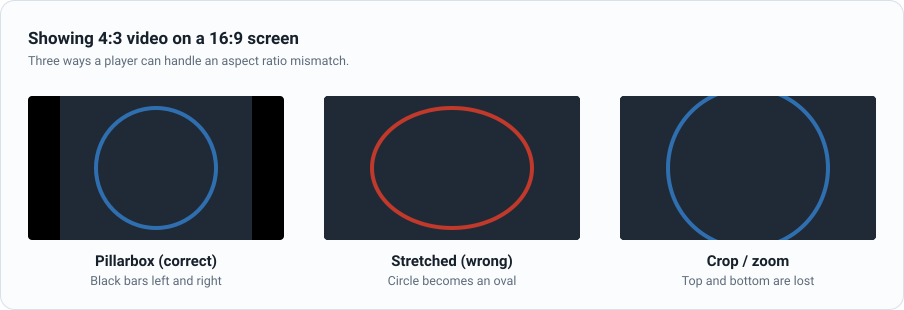

Multimedia is a term that refers to the combination of different media types, such as text, audio, and video, into a single presentation. It is a broad term that encompasses a wide range of technologies and applications.

Multimedia is used in a variety of contexts, including:

- Entertainment: Multimedia is used in movies, television shows, and other forms of entertainment.
- Education: Multimedia is used in schools and universities to create interactive learning experiences.
- Business: Multimedia is used in marketing and advertising to create engaging and informative presentations.

## Digital Video and Audio

All modern video and audio processing is done in digital domain. A video processing signal chain is about color space conversions along the way. These conversions have to be done at the pixel rate, for example, consider HD resolution which is 1920 × 1080 with 60 fps (frames per second). i.e. 1920 × 1080 × 60 pixels are coming in each second, which means 124.4 million pixels in each second.  Any operation that needs to be done on the bits of one pixel must be done so fast that the same operation can be done on 124.4 million pixels in the space of one second. In other words the frequency is 124.4 Mhz. In reality this is around 148 Mhz since we must account for the timing information in each video frame. A color plane refers to the bits associated with each color R, G or B, for example. Let’s say 8 bits for each color plane and let’s assume simple RGB color planes. Going back to the processing speed, each pixel’s 24 bits have to be manipulated at a frequency of 148 Mhz. If you use an 8-bit DSP, which can manipulate 8 bits, then you have to run this DSP at 3 × 148 Mhz to keep up with the pixels coming in. In practice HD video manipulation would normally be done on a 32-bit DSP or processor. This topic looks into the signal processing of video and audio that form part of a video signal. 

### Flipbook Analogy

Checkout [FLipbook](https://www.youtube.com/watch?v=hio2CGVLihY)

### Video

Key Concepts:

- **FPS**: Frames per second. Typically 24, 25, 30, 60, 29.97 and 59.94.
- **Resolution**: Width and height of the video. Typical resolutions are as follows:
  - 1080p: 1920x1080 a.k.a. Full HD
  - 720p: 1280x720 a.k.a. HD
  - 480p: 640x480 a.k.a. SD
  - 360p: 480x360 a.k.a. SD
  - 240p: 320x240
  - 144p: 176x144
- **Bitrate**: The amount of data used to represent the video.
- **Pixel(Picture element)**: A pixel is the smallest unit of a digital image. It is a dot on the screen that represents a specific color and brightness.

Images are played on screen at FPS that gives the illusion of motion.

Representation in python: Numpy array of shape **(n, width, height, 3)** where n is the number of frames stacked. Each number in the array is a 
uint8 with values between 0 and 255.

### Interlaced Video

In **progressive** video (the "p" in 1080p), each frame contains every line of the picture. In **interlaced** video (the "i" in 1080i or 576i), each frame is split into two **fields**:

- **Top field**: the odd lines (1, 3, 5, ...)
- **Bottom field**: the even lines (2, 4, 6, ...)

The two fields are captured at different instants and shown one after the other, so 1080i at 25 frames per second actually delivers 50 fields per second. This doubles the motion rate without increasing bandwidth, which is why analog TV standards (PAL, NTSC) and many broadcast formats use it.

Interlacing was invented to get high refresh-rate motion and low flicker without paying the bandwidth cost of full high-frame-rate progressive video.

Key Concepts:

- **Field order**: Which field comes first, top field first (TFF) or bottom field first (BFF). Getting it wrong makes motion judder.
- **Combing artifacts**: On a progressive display, the two fields of a moving object don't line up, producing a comb-like pattern along edges.
- **Deinterlacing**: Converting interlaced video to progressive, for example with FFmpeg's `yadif` or `bwdif` filters:

```bash
ffmpeg -i interlaced.mpg -vf bwdif output.mp4
```

Example interlaced MPEG-2 clips: [samples.ffmpeg.org/MPEG2/interlaced](https://samples.ffmpeg.org/MPEG2/interlaced/). Use `ffprobe` to see the field order, and pause on a scene with motion to see the combing.

### Aspect Ratio

The **aspect ratio** is the ratio of a picture's width to its height. A 1920x1080 frame is 1920 / 1080 = 16:9.



When the video's aspect ratio doesn't match the screen, the player has three choices:



- **Letterbox / pillarbox**: Add black bars on the top and bottom (letterbox) or on the left and right (pillarbox). The whole picture is shown with the right shape.
- **Stretch**: Fill the screen by scaling width and height by different amounts. Everything is distorted, so circles become ovals.
- **Crop**: Zoom in until the screen is full. The shape is right, but the edges of the picture are cut off.

Pixels are not always square. There are three ratios to keep apart:

- **SAR (Storage Aspect Ratio)**: Width : height in pixels, e.g. 720x576 → 5:4.
- **PAR (Pixel Aspect Ratio)**: Shape of each pixel. 1:1 for square pixels.
- **DAR (Display Aspect Ratio)**: Shape of the picture on screen. **DAR = SAR × PAR**.

For example, a PAL DVD stores 720x576 pixels but shows them as 16:9 by using wide pixels (PAR 64:45). If a player ignores the PAR, the circle is drawn squashed. FFmpeg reports these values as `SAR` (which FFmpeg uses for the pixel aspect ratio) and `DAR`:

```bash
ffprobe -v error -select_streams v:0 -show_entries stream=width,height,sample_aspect_ratio,display_aspect_ratio input.mp4
```

### Audio

Key Concepts:

- **Sampling Rate**: Number of audio samples per second. Typically 44100, 48000, 96000, 192000.
- **Bitrate**: The amount of data used to represent the audio.
- **Bits per sample**: The number of bits used to represent each sample. Typically 16, 24, 32.
- **Channels**: The number of audio channels. Typically 1 for mono and 2 for stereo. 6 for 5.1 surround sound.

Representation in python: Numpy array of shape **(n, 2)** where n is the number of samples 
and 2 is the number of channels(stereo). Each number in the array is a float32 with values between -1 and 1.

Sampling Theorem: https://www.youtube.com/watch?v=FcXZ28BX-xE

## Raw Bitrate

### Raw Video Bitrate

Raw Video bitrate = Width * Height * FPS * Bits per pixel

1 pixel is represented by 3 bytes (24 bits) for RGB.

For example, a 1080p video at 30 FPS with 8 bits per pixel has a raw bitrate of 1080 * 1920 * 30 * 24 = 1.5Gbps

### Raw Audio Bitrate

Raw Audio bitrate = Sampling Rate * Bits per sample * Channels

For example, a 48000 Hz audio at 16 bits per sample with 2 channels has a raw bitrate of 48000 * 16 * 2 = 1.536Mbps


## Science of perception and human sensory evolution

Two subjects of interest:

- Psycho-visual studies: "Psycho-visual" refers to the study of how the human visual system perceives and interprets visual information
- Psycho-auditory studies: Psychoacoustics is the study of how humans perceive sound. It explores the relationship between the physical properties of sound and the psychological and physiological responses that humans experience when hearing.

Color, as we perceive it, is the visual experience resulting from the way our eyes and brain process different wavelengths of light. Objects don't inherently possess color; instead, they absorb and reflect light of varying wavelengths, which our eyes and brains then interpret as specific colors

Why 16 bits per sample for audio where as 8 bits per pixel for video?

### Human Hearing Sensitivity

    The human ear can detect an enormous range of volumes — from the quietest whisper to a jet engine.

    This range is roughly 96 dB in amplitude (from threshold of hearing to pain).

    16-bit audio can represent 65,536 distinct amplitude levels per sample.

    That gives about 96 dB of dynamic range, matching human hearing quite well.

#### Why We Need So Many Bits

    Audio amplitude is a linear signal, but we perceive loudness logarithmically (e.g., doubling the pressure doesn’t double the perceived loudness).

    To avoid perceptible quantization noise, especially in quiet passages (like classical music), we need 16 bits.

#### Evolutionary Angle

    Our auditory system evolved for:

        Detecting predators or prey in subtle sounds.

        Parsing complex patterns like speech in noisy environments.

    So we evolved extremely sensitive hearing, especially for dynamic range and temporal precision (down to microseconds).


### Human Visual Sensitivity

    Humans see light logarithmically, similar to hearing sound, but:

        We’re far less sensitive to small gradations in brightness or color compared to sound level changes.

        Most of our color discrimination occurs in mid-brightness ranges.

        We're also more sensitive to luminance (brightness) than to chrominance (color).

#### 8 Bits per Channel Is Usually Enough

    8 bits per color channel = 256 levels of red, green, blue

    That gives ~16.7 million colors (256³), which is enough to represent most color differences that humans can perceive on a screen.

    Modern TVs and cameras may use 10-bit or 12-bit color for HDR content, where smoother gradients and more detail in shadows/highlights are required.

#### Evolutionary Angle

    Vision evolved for detecting contrast, movement, and edges — not smooth gradations.

    Our eyes adapt quickly to lighting, and have fewer cones for color compared to the number of hair cells in the cochlea for sound.

    Most sensitive region (fovea) is a small part of the retina; peripheral vision has lower color and brightness resolution.


### Example videos

- https://www.youtube.com/watch?v=Q-KPrxjNojI 0-1000 Nits brightness


### Example python code to generate different dB tone

```python
import numpy as np
from scipy.io.wavfile import write
import os

# Parameters
sample_rate = 44100  # 44.1 kHz sample rate
duration = 1.0       # seconds
frequency = 1500     # 1.5 kHz tone

# Output directory
os.makedirs("sine_tones", exist_ok=True)

# Generate time axis
t = np.linspace(0, duration, int(sample_rate * duration), endpoint=False)

# Reference amplitude for 0 dBFS
ref_amplitude = 0.999  # Max just under 1.0 to avoid clipping

# Generate tones from -90 dB to 0 dB
for db in range(-90, 1):  # Inclusive of 0 dB
    # Convert dB to linear amplitude scale
    amplitude = ref_amplitude * (10 ** (db / 20))
    waveform = amplitude * np.sin(2 * np.pi * frequency * t)

    # Convert to 16-bit PCM format
    waveform_int16 = np.int16(waveform * 32767)

    # Save to WAV file
    filename = f"sine_tones/sine_1kHz_{db}dB.wav"
    write(filename, sample_rate, waveform_int16)

print("Generated sine tones from -90 dB to 0 dB in ./sine_tones")

```


