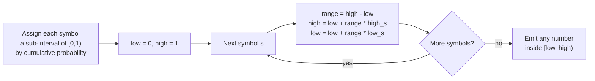
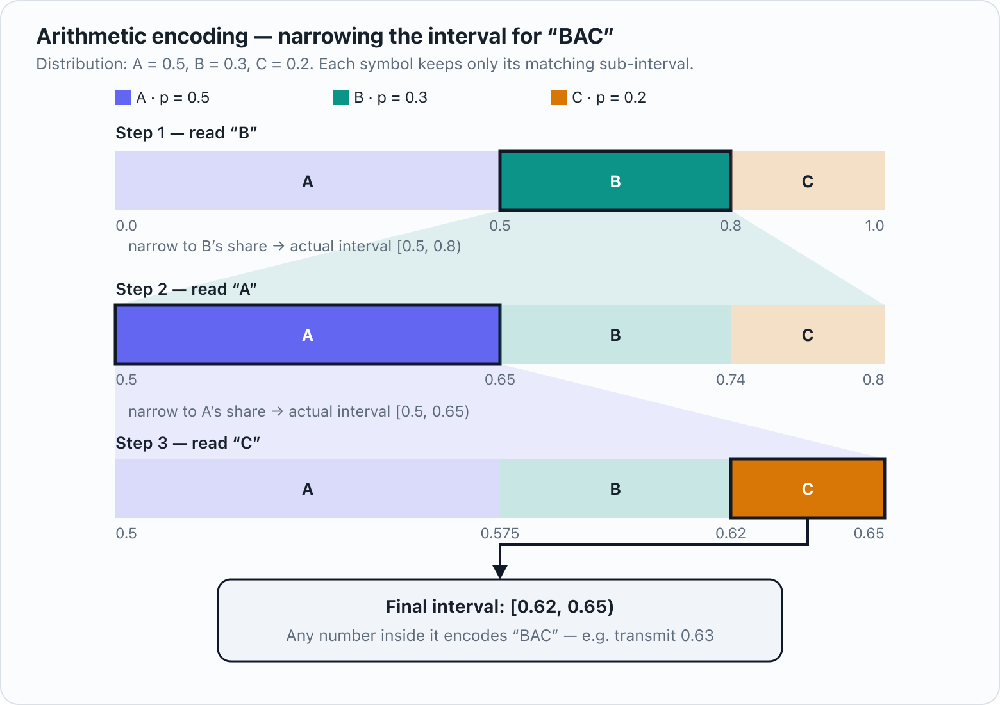
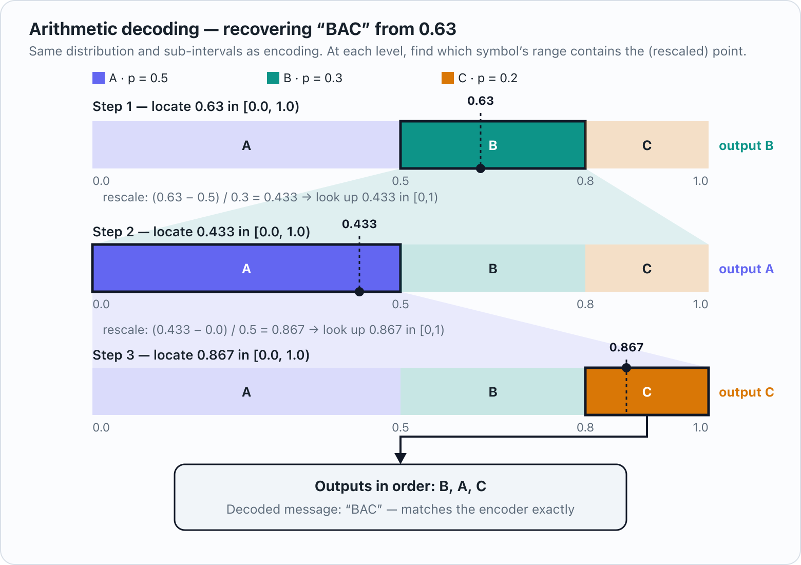

# Arithmetic Coding

## Motivation

[Huffman coding](./huffman_encoding.md) is optimal among codes that must assign a **whole number of bits** to every symbol — but that restriction itself costs bits. From the [source coding theorem](./shannon_coding_theorem.md), a symbol with probability $p$ should ideally cost $-\log_2 p$ bits, which is almost never an integer.

This hurts most when a symbol is very likely. Take a binary source with $P(0) = 0.9,\ P(1) = 0.1$:

* Ideal cost of a `0`: $-\log_2 0.9 \approx 0.152$ bits.
* Huffman still has to spend **at least 1 whole bit** per symbol, because a binary alphabet only has two codewords to hand out (`0` and `1`).
* Entropy of the source is $H \approx 0.469$ bits/symbol — Huffman is stuck at $1$ bit/symbol here, more than double the bound.

Arithmetic coding removes the "integer bits per symbol" restriction entirely. Instead of assigning a separate codeword to each symbol, it encodes the **whole message as a single number** inside the interval $[0, 1)$. Every extra symbol just narrows that interval further, and the number of bits needed to describe the final interval is (very close to) $-\log_2(\text{probability of the whole message})$ — which, averaged over all possible messages, converges to $n \cdot H$. This is how arithmetic coding gets arbitrarily close to the Shannon bound, even for skewed or small-alphabet sources where Huffman can't.

## Core idea

1. Order the symbols and assign each one a sub-interval of $[0,1)$ proportional to its probability, using cumulative probabilities.
2. Start with the "current interval" $[0, 1)$.
3. For each symbol in the message, **shrink** the current interval to the sub-interval corresponding to that symbol (scaled to the current interval's size).
4. After the last symbol, the current interval is very small. Any number inside it uniquely identifies the entire sequence. Transmit a (short) binary fraction that falls inside that interval.
5. To decode, repeat the same interval-narrowing process: at each step, check which symbol's sub-interval the transmitted number falls into, output that symbol, and narrow the interval — exactly mirroring the encoder.

## Example 1 — a 3-symbol source

Source distribution: $A = 0.5,\ B = 0.3,\ C = 0.2$.

Cumulative sub-intervals of $[0,1)$:

| Symbol | Sub-interval |
|---|---|
| A | $[0.0, 0.5)$ |
| B | $[0.5, 0.8)$ |
| C | $[0.8, 1.0)$ |

**Encode "BAC":**

| Step | Symbol | range = high − low | new low | new high |
|---|---|---|---|---|
| 0 | — | — | 0.0 | 1.0 |
| 1 | B | 1.0 | $0 + 1.0(0.5) = 0.5$ | $0 + 1.0(0.8) = 0.8$ |
| 2 | A | 0.3 | $0.5 + 0.3(0.0) = 0.5$ | $0.5 + 0.3(0.5) = 0.65$ |
| 3 | C | 0.15 | $0.5 + 0.15(0.8) = 0.62$ | $0.5 + 0.15(1.0) = 0.65$ |

Final interval: $[0.62,\ 0.65)$. Any number in this range — say $0.63$ — is a valid encoding of "BAC".

The same narrowing process, drawn as nested sub-intervals:

Notice the final interval's width is exactly the sequence's probability: $0.3 \times 0.5 \times 0.2 = 0.03$. The number of bits needed to pin down a number inside an interval of width $w$ is about $-\log_2 w$, so here that's $-\log_2 0.03 \approx 5.06$ bits for these 3 symbols — in the same ballpark as $3H = 3 \times 1.485 \approx 4.46$ bits (entropy of this distribution), and it gets closer to $nH$ as the message gets longer.

**Decode $0.63$ (knowing the message length is 3):**

| Step | Current interval | Where does 0.63 fall? | Output |
|---|---|---|---|
| 1 | $[0,1)$ | $0.63 \in [0.5, 0.8)$ → B's range | **B** |
| 2 | narrow to $[0.5, 0.8)$ | rescale: $(0.63-0.5)/0.3 = 0.433 \in [0,0.5)$ → A's range | **A** |
| 3 | narrow to $[0.5, 0.65)$ | rescale: $(0.433-0)/0.5 = 0.867 \in [0.8,1.0)$ → C's range | **C** |

Decoded message: **BAC** ✓, matching the encoder exactly.

Visually, decoding is the same nested-interval picture, just walked using the transmitted number instead of the original symbols — at each level, find which symbol's range contains the (rescaled) point, output that symbol, then zoom into that range and repeat:

## Example 2 — why skew matters (binary source)

Source: $P(0) = 0.9,\ P(1) = 0.1$, so $0 \to [0, 0.9)$ and $1 \to [0.9, 1.0)$. Entropy $H \approx 0.469$ bits/symbol.

**Encode the most likely sequence "000":**

| Step | Symbol | range | new low | new high |
|---|---|---|---|---|
| 0 | — | — | 0.0 | 1.0 |
| 1 | 0 | 1.0 | 0.0 | 0.9 |
| 2 | 0 | 0.9 | 0.0 | 0.81 |
| 3 | 0 | 0.81 | 0.0 | 0.729 |

Final interval width $= 0.9^3 = 0.729$, needing only $-\log_2 0.729 \approx 0.456$ bits total for all 3 symbols — a fixed-length or Huffman code could never go below $3 \times 1 = 3$ bits here, since each symbol individually needs at least 1 bit.

**Encode a less likely sequence "001":**

| Step | Symbol | range | new low | new high |
|---|---|---|---|---|
| 0 | — | — | 0.0 | 1.0 |
| 1 | 0 | 1.0 | 0.0 | 0.9 |
| 2 | 0 | 0.9 | 0.0 | 0.81 |
| 3 | 1 | 0.81 | $0.81(0.9) = 0.729$ | 0.81 |

Final interval width $= 0.9 \times 0.9 \times 0.1 = 0.081$, needing $-\log_2 0.081 \approx 3.63$ bits — *more* than a naive 3-bit fixed code would need for this particular sequence.

This is not a contradiction: arithmetic coding spends few bits on likely sequences and more on unlikely ones, exactly matching $-\log_2 P(\text{sequence})$ for whichever sequence actually occurs. Averaged over **all** possible 3-symbol sequences weighted by their probability, the expected cost converges to $3H \approx 1.41$ bits — far better than the 3 bits a fixed-length or single-bit-per-symbol code is stuck with, even though any one specific sequence can individually cost more or less than that average.

## Practical notes

* Real implementations don't use infinite-precision fractions — they use fixed-point integer arithmetic with **renormalization**: whenever the current interval's leading bits are decided (they stop changing no matter what comes next), those bits are output immediately and the interval is rescaled, so precision never actually runs out no matter how long the message is.
* The probability model doesn't have to be static. **Adaptive** arithmetic coding updates symbol probabilities as it goes (based on symbols seen so far or on context from neighboring data), which is exactly what **CABAC** (Context-Adaptive Binary Arithmetic Coding) does in H.264/HEVC — it is arithmetic coding with a probability model that adapts per-context, which is a major reason CABAC outperforms the simpler (Huffman-based) CAVLC entropy coder in those codecs.
