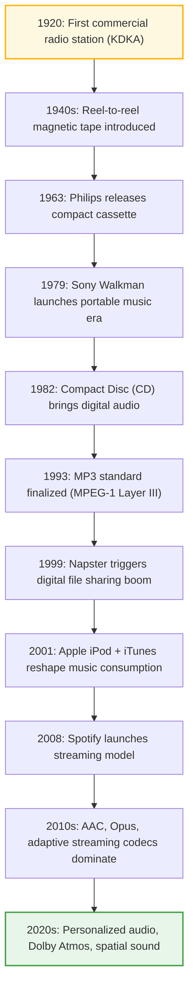
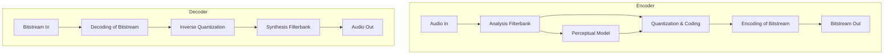

# Audio Compression

## Audio Consumption Evolution

**Lossy Compression Techniques**: MP3, AAC

**Lossless Compression Techniques**: FLAC

## AAC Compression Explanation

- **Filter bank**:
A filter bank is used to decompose the input
signal into subsampled spectral components
(time/frequency domain). Together with the corresponding
filter bank in the decoder it forms an
analysis/synthesis system.

- **Perceptual model**:
Using either the time domain input signal and/or
the output of the analysis filter bank, an estimate of
the actual (time and frequency dependent)masking
threshold is computed using rules known from psychoacoustics.
This is called the perceptual model
of the perceptual encoding system.

- **Quantization and coding**:
The spectral components are quantized and coded
with the aim of keeping the noise, which is introduced
by quantizing, below the masking threshold.
Depending on the algorithm, this step is done in
very different ways, from simple block companding
to analysis-by-synthesis systems using additional
noiseless compression.

- **Encoding of bitstream**:
A bitstream formatter is used to assemble the bitstream,
which typically consists of the quantized
and coded spectral coefficients and some side information,
e.g. bit allocation information.

# References

1. https://www.ee.columbia.edu/~dpwe/papers/Brand99-mp3.pdf
