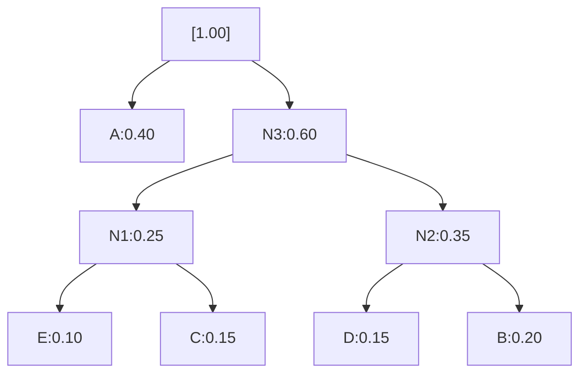

# Example of Huffman coding

# 1) Symbols and probabilities

Let’s use:

* A: 0.40
* B: 0.20
* C: 0.15
* D: 0.15
* E: 0.10
  (sum = 1.00)

# 2) Build the Huffman tree (combine two smallest each time)

Start with leaf nodes sorted by probability (ascending):

```
E:0.10, C:0.15, D:0.15, B:0.20, A:0.40
```

**Step 1:** combine E(0.10) + C(0.15) → N1(0.25)
Remaining: `D:0.15, B:0.20, N1:0.25, A:0.40`

**Step 2:** combine D(0.15) + B(0.20) → N2(0.35)
Remaining: `N1:0.25, N2:0.35, A:0.40`

**Step 3:** combine N1(0.25) + N2(0.35) → N3(0.60)
Remaining: `N3:0.60, A:0.40`

**Step 4:** combine A(0.40) + N3(0.60) → Root(1.00)

(When combining pairs, ties can be broken arbitrarily; it only affects which specific 0/1 patterns end up on each symbol, not the code lengths.)

# 3) Assign bits (0 to left, 1 to right, for example)

From the final merges:



Follow root→leaf paths to get codes (left=0, right=1):

* A: `0`
* E: path 1→0→0 → `100`
* C: path 1→0→1 → `101`
* D: path 1→1→0 → `110`
* B: path 1→1→1 → `111`

These codes are prefix-free (no code is a prefix of another).

# 4) Average code length (optional check)

Code lengths: A=1, B=3, C=3, D=3, E=3
Expected length $L$ = $0.40·1 + 0.20·3 + 0.15·3 + 0.15·3 + 0.10·3 = 2.2$ bits/symbol.

Entropy $H$ (for curiosity) ≈ 2.146 bits/symbol, and Huffman guarantees $H \le L < H+1$, which holds: $2.146 < 2.2 < 3.146$.

# 5) How you’d encode/decode

* **Encode:** replace each symbol with its code (e.g., “ABE” → `0 111 100` → `0111100`).
* **Decode:** read bits from left to right walking the tree until hitting a leaf, output that symbol, then restart from the root.
