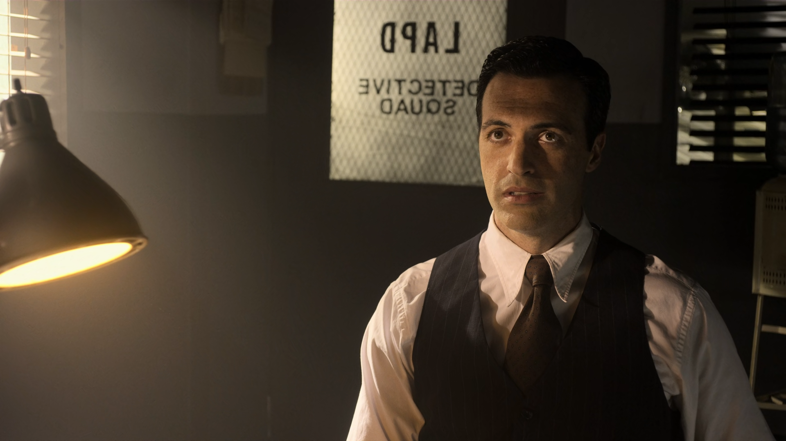

# Measuring Video Quality

# 1. What is PSNR?

* It’s a **logarithmic measure** (in decibels, dB) of the difference between the original and compressed (distorted) signals.
* Based on **Mean Squared Error (MSE)** between pixel values.

Formula for an image (frame):

$$
\text{MSE} = \frac{1}{M \cdot N} \sum_{i=0}^{M-1}\sum_{j=0}^{N-1} (I(i,j) - K(i,j))^2
$$

* $I(i,j)$: pixel from original frame
* $K(i,j)$: pixel from compressed frame
* $M \times N$: frame dimensions

Then:

$$
\text{PSNR} = 10 \cdot \log_{10}\!\left(\frac{MAX_I^2}{\text{MSE}}\right)
$$

where $MAX_I$ is the maximum possible pixel value (255 for 8-bit video).

---

# 2. For a Video

* Compute **MSE per frame**.
* Convert each MSE to **PSNR per frame**.
* Report:

  * Average PSNR over all frames.
  * Or a per-frame curve.

---

# 3. Example Workflow

1. Compress the video with your encoder.
2. Decode the compressed video back to raw (e.g., YUV).
3. Compare **original YUV** vs **compressed YUV** frame by frame.

   * Typically, PSNR is measured on the **luma (Y) plane**, since human vision is more sensitive to brightness.
   * Optionally also report PSNR for chroma (U, V).

---

# 4. Tools to Compute PSNR

### **FFmpeg** (most practical)

```bash
ffmpeg -i original.mp4 -i compressed.mp4 -lavfi psnr="stats_file=psnr.log" -f null -
```

* Outputs per-frame PSNR values and an average.
* Example output:

  ```
  n:0 mse_avg:12.3 mse_y:10.2 mse_u:14.1 mse_v:12.6 psnr_avg:37.2 psnr_y:38.1 psnr_u:36.6 psnr_v:37.1
  ```


# 5. Typical Values

* **30–40 dB** → good quality.
* **>40 dB** → excellent, nearly visually lossless.
* **&lt;30 dB** → visible artifacts.

---


**VMAF (Video Multi-method Assessment Fusion)** is Netflix’s perceptual video quality metric. It’s designed to track **human subjective perception** more closely than PSNR or SSIM.

---

# 1. What is VMAF?

* Developed by **Netflix Research**.
* Combines multiple quality metrics using **machine learning** (trained on human opinion scores).
* Inputs: Original (reference) video and distorted (compressed) video.
* Outputs: A score between **0 and 100**.

  * 100 = indistinguishable from original
  * 80–90 = good quality (minor artifacts)
  * &lt;60 = poor quality

### Features used (examples):

* **Detail loss** (via multi-scale SSIM).
* **Blockiness & blurriness** (edge statistics).
* **Temporal features** (motion stability).

The ML model fuses these into one **per-frame VMAF score**, and then averages across frames.

---

# 2. How to Run VMAF with FFmpeg

You need FFmpeg compiled with **libvmaf** (most modern builds have it).

### Basic Command

```bash
ffmpeg -i distorted.mp4 -i reference.mp4 \
  -lavfi libvmaf="model_path=/usr/local/share/model/vmaf_v0.6.1.json:log_path=vmaf.json:log_fmt=json" \
  -f null -
```

### Explanation:

* `distorted.mp4`: compressed/encoded video
* `reference.mp4`: original high-quality video
* `model_path`: VMAF model file (Netflix provides JSON models)

  * Common: `vmaf_v0.6.1.json`, `vmaf_4k_v0.6.1.json`
* `log_path`: file to save per-frame and mean VMAF results
* `log_fmt`: output format (`xml`, `json`, `csv`)

### Example Output (in console or log):

```
VMAF score: 93.456789
```

---

# 3. Practical Notes

* Input videos must be the **same resolution and frame rate** (so align with scaling if needed).
* If your test video is 720p but original is 1080p, downscale the reference before computing:

  ```bash
  ffmpeg -i ref_1080p.mp4 -vf scale=1280:720 ref_720p.mp4
  ```
* VMAF is **slower than PSNR/SSIM** but much closer to human judgment.

---

# Reference

https://netflixtechblog.com/toward-a-practical-perceptual-video-quality-metric-653f208b9652

# Example Images




