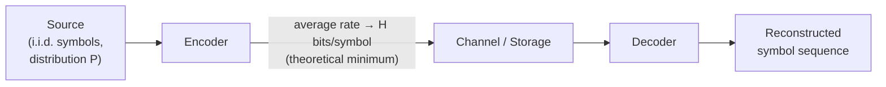

# Shannon's Source Coding Theorem

## The idea

Imagine a source that keeps emitting symbols one after another, where each symbol is drawn **independently** from the same probability distribution (an i.i.d. source) — for example a die that is rolled over and over, or a text generator that picks the next character purely based on fixed letter frequencies.

Shannon's source coding theorem says that no matter how clever the encoding scheme is, the **best possible lossless encoder** cannot do better, on average, than:

$$H = -\sum_{i} p_i \log_2 p_i \quad \text{bits per symbol}$$

$H$ is the **entropy** of the source's probability distribution. It is a hard lower bound:

* You **cannot** compress the source below $H$ bits/symbol on average, no matter how good your algorithm is.
* You **can** get arbitrarily close to $H$ with a good enough code (Huffman coding gets within 1 bit of $H$; arithmetic/range coding gets essentially all the way to $H$).

Intuitively: entropy measures how "surprising" or "unpredictable" the source is. A predictable source (one symbol dominates) has low entropy and compresses well. A source where every symbol is equally likely is maximally unpredictable and does not compress at all.

## Block diagram

The theorem is a statement about the **Encoder** box: as the encoder is made better and better, its average output rate approaches $H$ from above, but can never go below it.

## Simple examples

| Source | Distribution | Entropy $H$ | Comment |
|---|---|---|---|
| Fair coin | $P(H)=0.5,\ P(T)=0.5$ | $1$ bit/symbol | Maximum uncertainty for 2 symbols — no compression possible, 1 bit is already optimal. |
| Biased coin | $P(H)=0.9,\ P(T)=0.1$ | $\approx 0.469$ bits/symbol | Mostly predictable — a good code uses far fewer than 1 bit/symbol on average. |
| Fair 4-sided die | $P=0.25$ each | $2$ bits/symbol | Equally likely symbols → entropy equals $\log_2(\text{number of symbols})$; plain 2-bit binary code is already optimal. |
| 5-symbol skewed source | $A{=}0.40,\ B{=}0.20,\ C{=}0.15,\ D{=}0.15,\ E{=}0.10$ | $\approx 2.146$ bits/symbol | Same distribution used in [Huffman coding example](./huffman_encoding.md); Huffman achieves $2.2$ bits/symbol, close to the $2.146$-bit bound. |
| Near-constant source | $P(A)=0.99,\ P(\text{other 9 symbols})=0.00111\ \text{each}$ | $\approx 0.148$ bits/symbol | Almost always the same symbol — highly compressible, close to $0$ bits/symbol. |

Notice the pattern: **the flatter the distribution, the higher the entropy and the less compressible the source; the more skewed the distribution, the lower the entropy and the more compressible the source.**

## Relevance to image compression

An image can be viewed as a source emitting symbols (pixel values, or more usefully, quantized transform coefficients as in JPEG/DCT-based codecs). Shannon's theorem then tells us two things:

1. **There is a floor.** Once you decide *how* you are going to represent the image data (e.g., quantized DCT coefficients with some probability distribution), no entropy coder — Huffman, arithmetic coding, range coding — can push the average bits/symbol below the entropy of that data. This is exactly why JPEG, H.264, HEVC, etc. all use an entropy-coding stage (Huffman or CABAC/arithmetic coding) at the very end of the pipeline: it is the stage that is trying to reach the Shannon limit for whatever data reaches it.

2. **The real compression win comes from making the source's redundancy visible to the entropy coder.** This part is easy to state backwards, so it's worth being careful.

   Neighboring pixels in a natural image are correlated, which means each pixel is genuinely *predictable* from its neighbors. A basic information-theory fact is that conditioning never increases entropy: $H(X \mid \text{neighbors}) \le H(X)$. So the **true** information content per pixel, once you account for context, is actually *low* — correlation is redundancy, and redundancy is exactly what should compress well.

   The catch is that a plain (order‑0, memoryless) entropy coder — the kind Shannon's theorem describes — only ever looks at the **marginal histogram** of symbol values. It has no notion of position or neighbors, so it is structurally blind to the correlation. Its achievable rate is bounded by the *marginal* entropy $H(X)$, which sits above the true, context‑aware entropy $H(X\mid\text{neighbors})$ precisely because it ignores that redundancy. Feed raw pixels straight into such a coder and you leave that redundancy on the table.

   **Prediction is the mechanism that converts invisible context-redundancy into visible marginal-redundancy.** Replace each pixel with a residual (pixel − predicted value from its neighbors). If the predictor is good, the residual is close to zero almost everywhere, giving a sharply peaked (Laplacian-like) histogram. This residual's own *marginal* entropy is now low — not because information was destroyed, but because the predictor already did the conditioning, so an ordinary memoryless entropy coder applied to the residual can now get close to $H(X\mid\text{neighbors})$, the real information content, without needing to model context itself. The DCT plays a similar role for spatial-frequency redundancy: it concentrates energy into a few large low-frequency coefficients and many near-zero high-frequency ones, again turning correlation the entropy coder couldn't see into a skewed, low-entropy histogram it can exploit. Quantization then discards some of the remaining information on top of that (this is the lossy step).

In short: the source coding theorem bounds what an entropy coder can do *given the distribution it is handed*. Prediction and transforms don't lower the image's true information content — they re-expose redundancy that was always there (as correlation) in a form a simple, memoryless entropy coder can actually reach the Shannon bound for.
