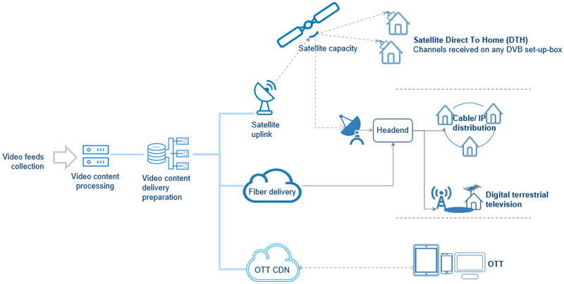

# 📺 MPEG-TS: From Elementary Streams to Transport Streams

*A Visual Journey Through Digital Television Broadcasting*

---

## 🎯 Presentation Overview

This presentation covers:
- TV Distribution Models
- Elementary Streams (ES) to Packetized Elementary Streams (PES) 
- PES to Transport Stream (TS) conversion
- PES and TS packet syntax
- Multiple Program Transport Stream (MPTS)

---

## Slide 1: TV Distribution Models 📡

### Key Distribution Channels:
- **Terrestrial Broadcasting** 📻
- **Satellite Broadcasting** 🛰️
- **Cable Distribution** 📺
- **IPTV/OTT Streaming** 🌐

**Why MPEG-TS?**
- Robust error recovery for broadcast environments
- Multiplexing multiple programs in single stream
- Synchronization across audio/video streams
- Built for lossy transmission mediums

---

## Slide 2: The Complete Pipeline - ES → PES → TS 🔄

### The Three-Stage Process:

1. **Elementary Stream (ES)** 
   - Raw compressed audio/video data
   - Continuous stream of codec data (H.264, AAC, etc.)

2. **Packetized Elementary Stream (PES)**
   - ES data wrapped in PES packets
   - Adds timing information (PTS/DTS)
   - Variable length packets

3. **Transport Stream (TS)**
   - Fixed 188-byte packets
   - Multiplexes multiple PES streams
   - Adds error correction and program information

---

## Slide 3: PES to TS Conversion Detail 📦

### Key Conversion Steps:

- **PES Packet Segmentation**: Variable-length PES packets split into fixed 188-byte TS packets
- **Packet Identifier (PID)**: Each TS packet gets unique PID for stream identification
- **Adaptation Field**: Handles timing and stuffing for incomplete packets
- **Continuity Counter**: Ensures packet order and detects losses

### Benefits of Fixed Packet Size:
- Predictable bandwidth usage
- Hardware-friendly processing
- Error resilience in broadcast scenarios

---

## Slide 4: PES Packet Syntax Structure 📋

### PES Header Components:

- **Start Code Prefix**: `0x000001` - Packet synchronization
- **Stream ID**: Identifies content type (video/audio/subtitle)
- **Packet Length**: Size of PES packet data
- **PTS/DTS**: Presentation/Decode Time Stamps for A/V sync
- **Optional Fields**: Copyright, scrambling, priority flags

### Critical for Streaming:
- **Timing Information**: Ensures proper A/V synchronization
- **Stream Identification**: Separates different content types
- **Metadata Support**: Additional information for decoders

---

## Slide 5: Transport Stream Packet Syntax 🔧

### TS Packet Structure (188 bytes):

#### Header (4 bytes):
- **Sync Byte**: `0x47` - Packet alignment marker
- **Transport Error Indicator**: Error flag for corrupted packets
- **Payload Unit Start**: Indicates start of PES packet
- **PID (13 bits)**: Stream identifier (0x0000-0x1FFF)
- **Continuity Counter**: 4-bit sequence number

#### Adaptation Field (Variable):
- **PCR (Program Clock Reference)**: System timing reference
- **Stuffing**: Padding for incomplete packets
- **Splice Points**: Commercial insertion markers

#### Payload (Variable):
- Actual PES packet data or PSI tables

---

## Slide 6: Multiple Program Transport Stream (MPTS) 📺

### MPTS Architecture:

#### Program Structure:
- **Multiple Programs**: Single TS can carry multiple TV channels/programs
- **Program Association Table (PAT)**: Lists all programs in the stream (PID 0x0000)
- **Program Map Table (PMT)**: Details streams within each program
- **Elementary Streams**: Video, audio, subtitles for each program

#### Key Benefits:
- **Bandwidth Efficiency**: Multiple channels in one transport stream
- **Broadcasting Economics**: Reduce transmission costs
- **Bouquet Management**: Group related channels together
- **Statistical Multiplexing**: Share bandwidth dynamically between programs

### Real-World Applications:
- **Digital TV Broadcasting**: Terrestrial, cable, satellite multiplexes
- **IPTV Headends**: Service provider channel bundling
- **Contribution Links**: Studio-to-transmitter feeds
- **Archive Systems**: Multi-program recording and storage

### Technical Considerations:
- **PID Management**: Unique identifiers across all programs
- **PSI/SI Tables**: Program and service information
- **Conditional Access**: Encryption and subscriber management
- **Quality of Service**: Bandwidth allocation per program

---

## 🎊 Key Takeaways

### Why MPEG-TS Matters:

1. **Broadcasting Standard** 📡
   - Used in DVB, ATSC, ISDB digital TV standards
   - Foundation for over-the-air television

2. **Streaming Applications** 🌐
   - HLS (HTTP Live Streaming) uses TS segments
   - Live streaming and VOD delivery

3. **Robust Design** 💪
   - Fixed packet size for predictable performance
   - Error resilience with sync bytes and continuity counters
   - Multiple program multiplexing capability

4. **Professional Workflows** 🎬
   - Broadcast equipment integration
   - Real-time encoding and multiplexing
   - Quality monitoring and analysis

### Modern Usage:
- **HLS Streaming**: Apple's HTTP Live Streaming
- **Digital TV**: Terrestrial, cable, satellite broadcasting
- **Live Production**: Real-time streaming applications
- **Archive Systems**: Long-term storage with robust error handling

---

## 📚 Further Reading

### Documentation:
- [MPEG-TS Introduction](./intro.md) - Basic container format overview
- [HLS Streaming Guide](../streaming/intro.md) - HTTP Live Streaming implementation

### Technical References:
- [MPEG-TS Introduction PDF](pdfs/mpegts-introduction.pdf) - Comprehensive technical introduction to MPEG Transport Stream fundamentals, packet structure, and multiplexing concepts
- [MPEG-2 Overview by Sarginson](pdfs/sarginson_mpeg2_overview.pdf) - Detailed technical overview of MPEG-2 systems, including transport stream specifications and broadcasting standards

---

*This presentation demonstrates the evolution from raw elementary streams to broadcast-ready transport streams, showing why MPEG-TS remains crucial for modern digital television and streaming applications.* 